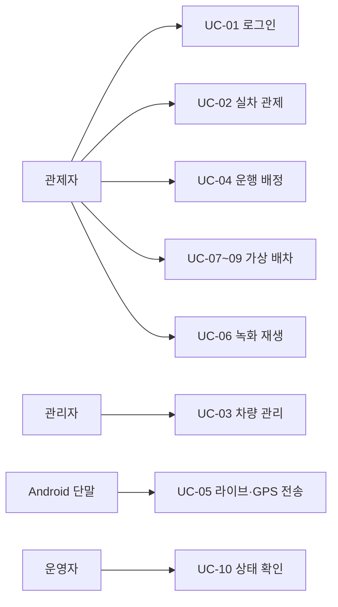

# 3. 유스케이스

## 행위자와 표기

주 행위자는 관리자, 관제자, 조회자, Android 단말 사용자다. Go 릴레이, Vision, 라우팅/추적, PostgreSQL과 객체 저장소는 보조 시스템이다. 정상 흐름은 현재 코드에 연결된 동작을 설명한다. 외부 서비스가 필요한 흐름은 실행 환경에 따라 실패할 수 있다.

## UC-01 로그인 및 권한 사용

- **관련 요구:** UR-01, FR-01. **주 행위자:** 모든 관제 사용자.
- **선행조건:** 활성 계정과 Node·DB가 준비됨.
- **기본 흐름:** 사용자가 ID/비밀번호 제출 → Node가 비밀번호와 계정 상태 검증 → JWT 발급 → 이후 요청에서 역할 검사.
- **예외/결과:** 잘못된 자격 증명은 401, 비활성 계정은 403, 허용되지 않은 쓰기 작업은 거부된다. 개발용 공개 데모 경로는 별도 설정으로 열리는 읽기 경로이며 일반 인증의 대체 정책이 아니다.
- **근거:** [인증 서비스](../../node/src/modules/auth/auth.service.ts), [데모 라우터](../../node/src/modules/demo/demo.router.ts).

## UC-02 실차 위치 확인 및 BIMS 소스 전환

- **관련 요구:** UR-02–03, FR-02–03. **주 행위자:** 관제자/조회자.
- **선행조건:** 추적 서비스가 실행 중이고 해당 데이터 소스가 준비됨.
- **기본 흐름:** 관제 화면이 차량 스냅샷 요청 → Node가 Python 추적 서비스의 BIMS·단말 관측을 받아 DB 차량과 결합 → 지도에 출처, 최근 위치, 배정 운행과 경로 표시 → 관제자가 `live` 또는 `playback` 소스와 실시간 GPS 지연 시 위치 보정 설정을 변경.
- **예외/결과:** 추적 서비스 오류는 Node의 503과 화면 오류 상태로 전달된다. 위치 보정이 꺼져 있으면 지연된 GPS 위치를 유지하고 지연 상태를 표시한다. 소스 변경은 관리자/관제자에게만 허용된다.
- **근거:** [추적 라우터](../../node/src/modules/tracking/tracking.router.ts), [추적 서비스](../../node/src/modules/tracking/tracking.service.ts), [README](../../README.md).

## UC-03 차량 관리

- **관련 요구:** UR-04, FR-04. **주 행위자:** 관리자; 조회는 관제자·조회자도 가능.
- **기본 흐름:** 관리자가 차량 코드·상태와 선택 속성을 제출 → 입력 검증과 DB 저장 → 목록 또는 상세에서 확인 → 필요 시 수정·삭제.
- **예외/결과:** 중복 코드는 409, 없는 차량은 404, 잘못된 필드는 400 계열 오류로 처리한다. 수정은 관리자 또는 관제자, 생성·삭제는 관리자 권한이다.
- **근거:** [차량 라우터](../../node/src/modules/vehicle/vehicle.router.ts), [입력 스키마](../../node/src/modules/vehicle/vehicle.schema.ts).

## UC-04 실차 운행 배정·시작·종료

- **관련 요구:** UR-05, FR-05. **주 행위자:** 관제자와 Android 단말.
- **기본 흐름:** 관제자가 차량과 `DUAL` 목적지 또는 `REPLAY_ONLY` GPS 미리보기를 선택 → Node가 경로를 계산하거나 미리보기와 연결해 운행을 생성 → 단말이 배정 운행을 조회·시작·완료 → 관제자는 운행 표시와 녹화 목록을 조회.
- **예외/결과:** `DUAL`은 최근 GPS 시작점이 없을 때 출발점 지정이 필요하다. `REPLAY_ONLY`는 지정된 GPS 데이터 지문이 맞아야 시작할 수 있다. 상태 전이가 맞지 않거나 경로 계산에 실패하면 운행 생성·전이가 거부된다.
- **근거:** [운행 서비스](../../node/src/modules/trip/trip.service.ts), [단말 운행 API](../../node/src/modules/trip/device-trip.router.ts).

## UC-05 Android 영상·GPS/IMU 송출

- **관련 요구:** UR-06–07, FR-06–07. **주 행위자:** Android 단말 사용자.
- **기본 흐름:** 단말이 송출 세션을 시작해 Go 릴레이에 WebRTC offer 제출 → 릴레이가 스트림 문맥을 Node에서 확인 → H.264 영상을 Vision 피드로 전달 → GPS/IMU 배치를 릴레이로 전달 → 유효한 GPS를 Node에 저장하고 라이브 위치·Vision 프레임 정보에 반영.
- **예외/결과:** 영상 송출은 유효한 운행 문맥이 없어도 가능하나, 녹화·텔레메트리는 검증 결과나 설정에 따라 비활성화될 수 있다. 단말 연결이 끊기면 라이브 표시가 중단된다.
- **근거:** [Android 안내](../../android/README.md), [릴레이 시그널링](../../services/media-relay/internal/signaling/handlers.go), [내부 GPS API](../../node/src/modules/telemetry/telemetry.router.ts).

## UC-06 운행 녹화와 탐지 결과 재생

- **관련 요구:** UR-08, FR-08. **주 행위자:** 관제자/조회자.
- **기본 흐름:** 관제자가 운행의 MP4 구간 목록 조회 → 특정 구간의 단기 재생 URL 요청 → 브라우저가 객체 저장소에서 영상 재생 → 해당 구간의 탐지 샘플을 영상 PTS에 맞춰 표시.
- **예외/결과:** 저장·메타데이터 등록에 실패한 구간은 정상 재생 대상으로 취급하지 않는다. 탐지 샘플 응답의 `coverageIncomplete`는 누락 가능성을 알린다. 삭제는 관리자/관제자만 수행한다.
- **근거:** [녹화 API](../../node/src/modules/recording/recording.router.ts), [녹화 스키마](../../node/src/modules/recording/recording.schema.ts), [재생 UI](../../operator-web/replay-timeline.js).

## UC-07 가상 시나리오·차량·경로 초안

- **관련 요구:** UR-09, FR-09. **주 행위자:** 관제자.
- **기본 흐름:** 시나리오 생성 → 가상 차량 선택/생성 → 출발점·경유점·목적지를 지정하고 경로 미리보기 요청 → Node가 Python 도로 그래프를 조회 → 경로와 제약 버전이 포함된 초안 저장.
- **예외/결과:** 통행 가능한 경로가 없거나 도로 그래프와 초안 버전이 맞지 않으면 요청이 실패한다. 조회자는 기존 시나리오만 열람한다.
- **근거:** [가상 라우터](../../node/src/modules/virtual/virtual.router.ts), [내부 라우팅 클라이언트](../../node/src/modules/virtual/routing-internal.client.ts).

## UC-08 가상 배차 및 운행 제어

- **관련 요구:** UR-10–11, FR-10–11. **주 행위자:** 관제자.
- **기본 흐름:** 지정 차량·경로 초안으로 배차 요청 생성 → 관제자 수락 또는 시나리오의 자동 수락 시각 도래 → 가상 운행·경로·위치 상태 생성 → 서버 작업자가 위치를 진행·체크포인트 저장 → 관제자가 일시정지/재개·취소·경유점/목적지·차량별 자동 추종을 조절.
- **예외/결과:** 거절·만료·중복 수락 요청은 운행을 만들지 않는다. 경로 없음 또는 도로 차단은 정지 상태로 반영한다. 브라우저를 닫아도 서버 작업자는 동작한다.
- **근거:** [가상 서비스](../../node/src/modules/virtual/virtual.service.ts), [작업자](../../node/src/modules/virtual/virtual-simulation.worker.ts).

## UC-09 가상 도로 상태 변경

- **관련 요구:** UR-12, FR-12. **주 행위자:** 관제자.
- **기본 흐름:** 도로 구간 또는 영역 선택 → `BLOCKED`/`HEAVY_PENALTY` 영향 미리보기 → 유효한 제한 적용 → 해당 시나리오의 차량 경로 갱신 또는 안전 정지 → 이벤트 이력 조회.
- **예외/결과:** 점유 중 도로 차단 등 충돌은 거부된다. `HEAVY_PENALTY`는 통과 가능한 비용 변경이며 `BLOCKED`는 통과를 금지한다. 다른 시나리오의 상태에는 영향을 주지 않는다.
- **근거:** [가상 라우터](../../node/src/modules/virtual/virtual.router.ts), [가상 ERD](../v19_virtual_dispatch_erd.md).

## UC-10 서비스 상태 확인

- **관련 요구:** UR-13, QR-05. **주 행위자:** 시스템 운영자.
- **기본 흐름:** 개발/운영 Compose로 서비스를 구동 → 각 서비스 헬스와 DB 준비 확인 → 오류가 있으면 해당 서비스 로그·연결 설정 확인.
- **예외/결과:** Node `/health/ready`는 DB 쿼리 실패 시 준비 상태를 보고하지 않는다. 영상/GPU와 Android 실기기 동작은 별도 환경 검증이 필요하다.
- **근거:** [Node 앱](../../node/src/app.ts), [운영 안내](../integration/LINUX_STARTUP_RUNBOOK.md).
