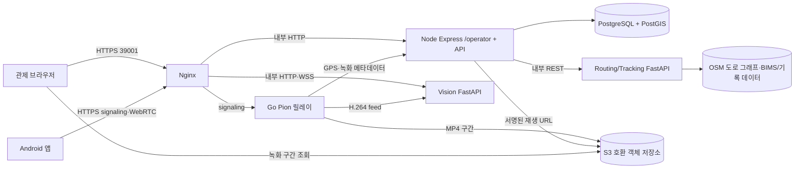

# 5. 시스템 아키텍처

## 구조와 책임

이 시스템은 하나의 저장소에서 여러 실행 프로세스를 구성한다. Node는 인증·운행·영속 업무 상태와 관제 API를 담당하고, Python 라우팅/추적 서비스는 도로 그래프 계산과 실시간 위치 원천을 처리한다. Android·Go·Vision은 영상과 단말 텔레메트리 경로를 구성한다. 실차와 가상 배차는 같은 관제 화면에서 접근하지만 별도 상태 모델을 사용한다.

도식의 공개 포트는 기본 배포 설정의 역할 구분을 나타낸다. 실제 포트와 서비스 구성은 [개발 Compose](../../docker-compose.dev.yml), [운영 Compose](../../docker-compose.prod.yml), [Nginx 설정](../../deploy/nginx/nginx.conf)을 확인한다.

## 핵심 데이터 흐름

### 1. 실차 추적·운행

1. 라우팅/추적 서비스가 BIMS 실시간 또는 재생 데이터와 단말 현재 위치를 정규화한다.
2. Node의 추적 API가 스냅샷을 받아 기존 차량·운행과 결합하고 브라우저에 전달한다. BIMS 차량은 필요할 때 등록되며 BIMS 관측 저장은 현재 추적 조회에 수반된다.
3. Android GPS는 Go 릴레이가 단말 세션을 검증한 뒤 Node 내부 API로 저장한다. `received_at`은 최신 수신 상태, `recorded_at`/`source_timestamp_ns`는 원본 기록 시각을 나타낸다.
4. `DUAL` 운행은 Node가 Python 경로 계산을 호출해 초기 경로를 보관한다. `REPLAY_ONLY` 운행은 업로드된 Android GPS 미리보기에 연결된다.

### 2. 영상·녹화

1. Android가 Go 릴레이에 WebRTC로 H.264를 게시한다. 릴레이는 Vision에 인코딩된 프레임을 공급한다.
2. Vision이 탐지·프레임 정보를 처리하고 브라우저의 `/ws/playback`에 전달한다. 여기서 `playback`은 라이브 버퍼 제어 채널이며 저장된 MP4 이력 API와 별개다.
3. 릴레이가 MP4 구간을 객체 저장소에 업로드하고 Node에 구간 메타데이터를 등록한다. Vision의 탐지 샘플도 Node의 별도 내부 경로로 등록된다.
4. 브라우저는 Node에서 녹화 목록·임시 재생 URL·탐지 샘플을 받아 PTS 기준으로 재생한다.

### 3. 가상 배차

1. 관제자가 시나리오·가상 차량·출발점/경유점/목적지를 설정한다.
2. Node가 Python의 내부 그래프 API로 경로와 도로 상태 영향을 계산하고 배차 초안·요청을 PostgreSQL에 저장한다.
3. 요청 수락 시 `VirtualTrip`, `VirtualRoute`, `VirtualVehicleState`가 생성된다. Node 서버의 시뮬레이션 작업자가 브라우저 연결과 독립적으로 위치를 진행하고 체크포인트를 저장한다.
4. 도로 차단·비용 증가·운행 명령은 해당 시나리오의 가상 상태에 적용한다. 가상 위치는 실제 `vehicle_position`에 기록하지 않는다.

## 배포와 장애 경계

| 경계 | 설계상 역할 | 장애 시 관찰되는 영향 |
|---|---|---|
| Nginx ↔ 브라우저/단말 | HTTPS 진입, WebSocket·시그널링 전달 | 관제 화면 또는 영상 접근 불가 |
| Node ↔ PostgreSQL | 계정·운행·녹화·가상 상태 영속화 | `/health/ready` 실패, 업무 API 장애 |
| Node ↔ 라우팅/추적 | 위치 스냅샷·경로 계산 | 추적 API 503 또는 경로 요청 실패 |
| Android ↔ Go ↔ Vision | 영상 수신·추론·라이브 뷰 | 라이브 영상/탐지 중단; 업무 DB와는 별도 경로 |
| Go/Node ↔ 객체 저장소 | MP4 업로드·재생 URL | 신규 구간 저장 또는 저장 영상 재생 실패 |

## 보안과 운영 관찰점

- Node 공개 업무 API는 JWT 역할 검사, 녹화·텔레메트리 내부 API는 서비스 토큰을 사용한다. 단말용 `/api/v1/device`의 현행 보호 방식은 별도이므로 동일한 JWT 정책을 가정하지 않는다.
- Nginx 뒤의 내부 서비스는 Compose 사설 네트워크에 둔다. Vision의 라이브 페이지는 브라우저 보안 컨텍스트가 필요하므로 공개 출처의 HTTPS/WSS 구성이 중요하다.
- Node는 `/health/live`, `/health/ready`; 라우팅/추적과 Vision은 `/health/live`; Go는 `/healthz`를 제공한다. 준비 상태와 실제 GPU·카메라·BIMS 연동 성공은 별개로 확인해야 한다.

## 기존 자료와의 관계

[v18 ERD](../v18_its_integrated_erd.md)는 실차 GPS·녹화 출처를, [v19 ERD](../v19_virtual_dispatch_erd.md)는 가상 배차 상태를 상세히 설명한다. [과거 v15 계획](../implementation_plan_ko_whole_project.md)의 Tauri·gRPC 중심 목표 구조는 현행 브라우저/WebRTC 통합 구조와 다르다.
