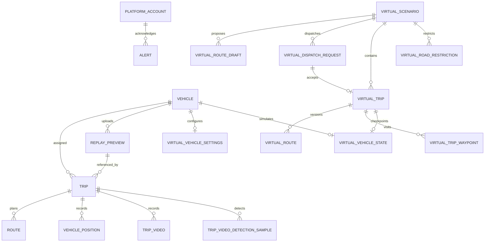

# 6. 도메인·데이터베이스 설계

## 설계 기준

영속 상태의 기준은 [Prisma 스키마](../../node/prisma/schema.prisma)와 [마이그레이션](../../node/prisma/migrations/)이다. 현재 모델은 **25개**이며, PostgreSQL 17/PostGIS를 사용한다. 공간 `geography` 필드는 Prisma Client에서 직접 다루기 어려워 TypedSQL 또는 raw SQL을 사용한다. 가상 영역은 실제 운행·센서 이력을 보존하기 위해 별도 테이블로 분리한다.

## 개념 모델

도식은 주요 관계만 표시한다. 전체 필드·선택 관계는 Prisma 스키마, [v18 ERD](../v18_its_integrated_erd.md), [v19 ERD](../v19_virtual_dispatch_erd.md)를 따른다.

## 테이블 목록과 역할

| 영역 | 테이블(Prisma 모델) | 주요 책임 |
|---|---|---|
| 계정·차량 | `platform_account` (`PlatformAccount`), `vehicle` (`Vehicle`), `driver` (`Driver`) | 사용자 역할, 차량 식별·제원·출처, 운전자 기초정보 |
| 실차 운행 | `trip` (`Trip`), `route` (`Route`), `vehicle_position` (`VehiclePosition`), `route_deviation` (`RouteDeviation`) | 운행 상태·모드, 계획 경로 버전, 실제 위치, 이탈 기록 구조 |
| 영상·탐지 | `trip_video` (`TripVideo`), `trip_video_detection_sample` (`TripVideoDetectionSample`), `object_class` (`ObjectClass`), `detection_event` (`DetectionEvent`), `event_image` (`EventImage`) | MP4 구간·프레임별 탐지 샘플, 객체 분류·이벤트 구조 |
| 관제·목표 | `alert` (`Alert`), `transport_goal` (`TransportGoal`) | 경고·운송 목표 데이터 구조 |
| 실차 재생 준비 | `replay_preview` (`ReplayPreview`) | Android GPS 데이터셋의 지문·표시 경로; `REPLAY_ONLY` 운행에 연결 |
| 가상 시나리오·배차 | `virtual_scenario` (`VirtualScenario`), `virtual_vehicle_settings` (`VirtualVehicleSettings`), `virtual_route_draft` (`VirtualRouteDraft`), `virtual_dispatch_request` (`VirtualDispatchRequest`) | 시나리오, 차량별 추종 정책, 경로 초안, 수락 대기 요청 |
| 가상 운행·도로 | `virtual_trip` (`VirtualTrip`), `virtual_route` (`VirtualRoute`), `virtual_trip_waypoint` (`VirtualTripWaypoint`), `virtual_vehicle_state` (`VirtualVehicleState`), `virtual_road_restriction` (`VirtualRoadRestriction`), `virtual_operator_event` (`VirtualOperatorEvent`) | 운행·경로 버전, 경유점, 현재 이동 체크포인트, 도로 제한, 운영 이력 |

## 핵심 식별자·관계·제약

- `vehicle.vehicle_source`는 `CUSTOM`·`BIMS`·`VIRTUAL`을 구별한다. BIMS 외부 ID는 출처와 묶인 고유 키다. `Vehicle`은 실차·가상 차량 모두의 기본 식별자지만 위치 저장 경로는 다르다.
- `trip.route_mode`는 `DUAL` 또는 `REPLAY_ONLY`; `route`는 운행별 버전과 현재 경로를 관리한다. `replay_preview`는 차량·데이터셋 지문이 고유하며 Android 기록 경로를 운행에 연결한다.
- `vehicle_position`은 PostGIS 4326 위치와 `recorded_at`, `received_at`, `source_timestamp_ns`, `recording_session_id`를 갖는다. `(recording_session_id, source_timestamp_ns)` 고유 키가 단말 GPS 재전송 중복을 방지한다. BIMS 행은 세션 값이 없다.
- `trip_video`는 `(recording_session_id, segment_index)`와 `object_key`의 고유성을 보장한다. 객체 저장소의 버킷·키가 영속 식별자이며 `video_url`은 레거시 호환 필드다. `trip_video_detection_sample`은 운행·세션·epoch·프레임 순번을 고유하게 관리한다.
- 가상 배차 요청은 고유 `idempotency_key`와 수락 운행 연결을 가지며, 마이그레이션의 부분 고유 인덱스가 중복 활성 운행을 제한한다. `virtual_route`는 `(virtual_trip_id, route_version)` 고유 키, `virtual_trip_waypoint`는 `(virtual_trip_id, sequence)` 고유 키를 사용한다.
- `virtual_road_restriction`은 시나리오·그래프 버전·제약 버전과 영향 받은 방향 간선/물리 구간을 보관한다. `virtual_vehicle_state`는 차량당 현재 가상 위치·간선·진행 거리·시뮬레이션 시간·명령 버전을 보관한다.

## 시간·좌표·데이터 소유권

| 데이터 | 시간/좌표 기준 | 소유·쓰기 경로 |
|---|---|---|
| 실제 GPS | WGS84/SRID 4326, 원본 관측 시각과 서버 수신 시각 분리 | Android → Go → Node 내부 GPS API; BIMS → 추적 스냅샷 → Node |
| 저장 영상 | relay epoch·frame sequence·90 kHz PTS, MP4 구간 | Go → 객체 저장소, Node `trip_video` 메타데이터 |
| 재생 탐지 | 동일 세션·epoch·영상 PTS | Vision/릴레이 경로 → Node `trip_video_detection_sample` |
| 가상 이동 | 방향 간선·오프셋·가상 경과 시간 | Node 작업자 → `virtual_vehicle_state`; `vehicle_position`에는 쓰지 않음 |
| 지도/경로 | GeoJSON `[경도, 위도]`; PostGIS geography 4326 | Node와 Python 라우팅 서비스 |

## 구현 상태를 읽는 방법

`Alert`, `RouteDeviation`, `ObjectClass`, `DetectionEvent`, `EventImage`, `TransportGoal`, `Driver`는 스키마에 존재한다. 이 브랜치의 Node 공개 라우터에는 이들을 포괄하는 완성 CRUD·관제 업무 흐름이 없다. 반면 저장 영상 재생에 사용하는 `TripVideoDetectionSample`은 별도 등록·조회 API가 있다. 테이블 존재만으로 사용자 기능 완료를 의미하지 않는다.
