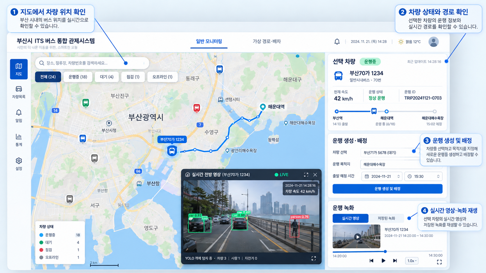
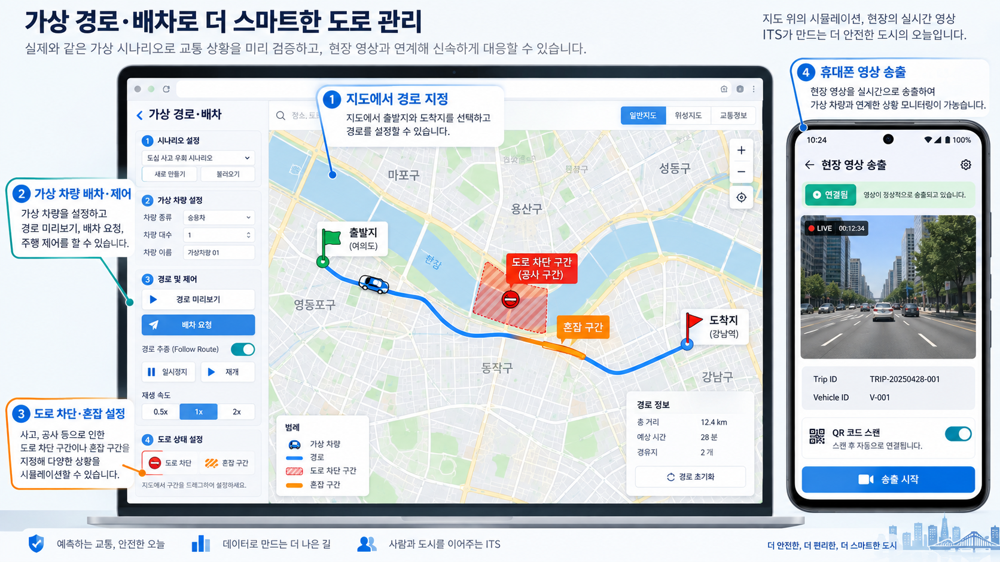

# ITS 플랫폼 UI 및 시연 시나리오

이 문서는 운영자 웹 대시보드와 안드로이드 영상 송출 앱을 소개하기 위한 시연 안내입니다. 아래 그림은 이 세션에서 만든 **개념 목업**입니다. 기능의 위치와 흐름을 설명하기 위한 이미지이므로 실제 실행 화면의 문구와 배치는 다를 수 있습니다.

## 1. 운영자 대시보드: 차량 상황 파악

운영자는 웹 대시보드에 로그인한 뒤 지도에서 차량 위치를 살펴봅니다. 차량 마커를 선택하면 상태, 속도, 운행 ID, 예정 경로 등을 확인할 수 있습니다. 필요하면 차량을 선택해 목적지를 지정하고 새 운행을 생성·배정합니다.

활성 녹화 세션과 연결된 차량은 **Live View**에서 도로 영상을 볼 수 있습니다. 영상 화면에는 객체 탐지 결과와 해당 영상 시점에 맞춘 위치·움직임 정보가 표시됩니다. 지난 운행은 **Trip recordings**에서 불러와 타임라인으로 원하는 구간을 재생합니다.

**발표 멘트 예시:** “지도에서 여러 차량의 현재 위치를 보고, 한 차량을 선택해 운행 상태와 영상을 자세히 확인합니다.”

## 2. 가상 경로·배차: 돌발 상황 대응 연습

상단의 **Virtual routing & dispatch** 작업 공간에서 시나리오와 가상 차량을 선택합니다. 지도에 출발지, 목적지, 필요한 경유지를 찍고 **Preview optimal path**로 경로와 예상 거리·시간을 확인합니다. 이어서 **Generate driver request**로 해당 가상 차량에 대한 배차 요청을 만들고, 요청 목록에서 수락하거나 거절합니다.

차량이 움직이는 동안 도로의 일부를 **Blocked**(차단) 또는 **Heavy penalty**(혼잡) 구역으로 지정해 경로 변화를 보여줄 수 있습니다. 선택 차량의 경로 추종 설정, 일시정지·재개, 속도 조절도 시연할 수 있습니다. 이는 실제 차량 운행 화면과 분리된 가상 시나리오입니다.

**발표 멘트 예시:** “도로가 막히거나 혼잡해졌을 때 가상 차량의 경로와 움직임이 어떻게 달라지는지 확인합니다.”

## 3. 안드로이드 앱: 현장 영상 송출

두 번째 그림 오른쪽의 휴대폰은 현장 카메라 앱을 표현합니다. 앱에서 서버 주소와 운행·차량 ID를 확인하고 카메라 영상을 송출합니다. 화면에는 카메라 미리보기, 연결 상태, QR 스캔 설정 등이 있습니다. 송출된 영상은 해당 세션이 연결되면 운영자 화면의 Live View에서 확인할 수 있습니다.

**발표 멘트 예시:** “현장 휴대폰이 도로 영상을 보내고, 운영자는 지도와 함께 그 영상을 확인합니다.”

## 추천 시연 순서

1. **지도 확인:** 일반 모니터링 화면에서 차량을 선택하고 상태와 경로를 설명합니다.
2. **영상 확인:** 활성 세션의 Live View를 열고, 이어서 운행 녹화의 타임라인을 재생합니다.
3. **가상 배차:** 가상 작업 공간에서 차량과 경로를 선택하고 미리보기 후 배차 요청을 수락합니다.
4. **상황 변화:** 지도에 혼잡 또는 차단 구역을 추가하고 차량 경로·상태 변화를 설명합니다.
5. **마무리:** 실제 모니터링과 가상 시나리오의 용도를 요약합니다.

실시간 영상 시연에는 송출 중인 안드로이드 기기와 연결된 활성 세션이 필요합니다. 영상이 준비되지 않았다면 녹화 재생으로 해당 부분을 설명할 수 있습니다.
