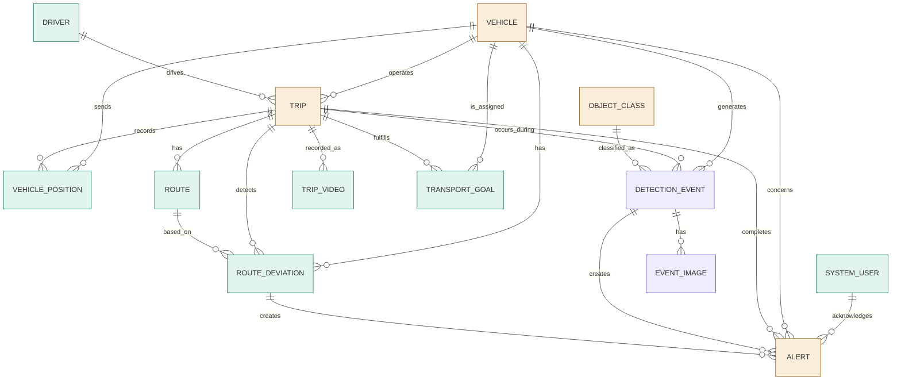

# 트럭 지능형 위험 감지 및 경로 관제 시스템 ERD 설계

## 1. 설계 기준

본 ERD는 다음 기능을 기준으로 설계한다.

- 실시간 차량 위치 관제
- 차량별 운행 경로 표시
- 경로 이탈 감지
- 경로 재탐색 및 변경 이력 관리
- YOLO 기반 객체 탐지
- 객체와 차량 사이 거리 측정
- 위험 기준 충족 시 관제 경고 생성
- 위험 이벤트 PostgreSQL 저장 및 조회
- 위험 이벤트 이미지 저장
- 누적 위험 및 운행 통계 분석

> 기존의 **운송 목표 / 배차 계획(추천·확정 등 계획 수립 기능)은 본 ERD에서 제외한다.** 단, 통계 화면에 배차 관련 수치(운송 목표 수, 완료율 등)를 표시하기 위한 **최소한의 `transport_goal` 테이블만 예외적으로 포함**한다 (v6, 아래 1.1 참고). 배차 추천 알고리즘, 계획 버전 관리, 계획-차량 매핑(`dispatch_plan`, `dispatch_assignment`, `dispatch_assignment_goal`)은 여전히 범위 밖이다.

---

## 1.1 변경 이력

| 버전 | 변경 내용 | 사유 |
|---|---|---|
| v1 | 최초 설계 (12개 테이블, `vehicle_camera` 포함) | — |
| v2 | `vehicle_camera` 테이블 제거, 카메라/캘리브레이션 정보를 `vehicle`에 통합 | 차량당 카메라 1대 전제. 1:N 관계가 필요 없어 JOIN 테이블 유지 비용만 발생 |
| v2 | `detection_event`에 `vehicle_code`, `class_name`, `display_name`, `warning_distance_m` 비정규화 추가 | `detection_event`는 조회 빈도가 가장 높은 핵심 테이블. `vehicle`/`object_class` JOIN을 제거해 이벤트 로그·재생·통계 화면이 대부분 단일 테이블 스캔으로 처리되도록 함 |
| v3 | `detection_event`에 `frame_id` 추가 | AI 백엔드 파이프라인(안드로이드 → Redis → GPU 탐지 서버 → 백엔드 → 관제실)이 `frame_id` 기준으로 프레임을 추적하는데, 이 값을 저장하는 컬럼이 없었음. 특정 탐지 결과가 어느 원본 프레임에서 나왔는지 역추적할 수 없어 디버깅·재생 화면 동기화가 불가능했던 문제를 해결 |
| v3 | `trip_video` 테이블 신규 추가 | `event_image`는 위험 이벤트 순간의 스냅샷만 저장하므로, 운행기록 재생 화면(영상 + GPS + 탐지결과 동기화 재생)에 필요한 **연속 영상 파일 자체에 대한 참조**가 어디에도 없었음. 재생 화면 구현 자체가 불가능한 누락이었음 |
| v4 | `VEHICLE \|\|--o{ ALERT` 관계 라벨을 `receives` → `concerns`로 수정 | 실제로는 관제사(`platform_account`)가 `alert.acknowledged_by`로 확인/처리하며, 차량으로 알림이 전달(push)되는 경로는 스키마 어디에도 없음. `receives`는 차량이 알림을 수신한다는 잘못된 인상을 주므로, 차량이 경고의 "대상"일 뿐임을 정확히 반영하도록 수정. FK(`alert.vehicle_id`) 자체는 변경 없음 |
| v5 | `alert`에 `trip_id` 컬럼 추가, `alert_type`에 `'TRIP_COMPLETED'` 추가, 이벤트 연결 제약을 3-way로 확장 (Gap 1 대응) | 목업 대시보드의 실시간 이벤트 피드에 "목적지 도착 완료" 같은 운행 완료 이벤트가 위험 알림과 함께 노출되는데, 기존 `alert`는 `detection_event`/`route_deviation`만 연결 가능해 이 이벤트의 근거가 없었음. 알림성 이벤트를 `alert` 하나로 통일하기 위해 `trip_id` 연결 케이스를 추가 |
| v5 | `alert`에 `operator_note` 컬럼 추가 (Gap 2 대응) | 이벤트 상세 화면의 "메모 추가" 기능이 저장할 곳이 없었음. 시스템 생성 메시지(`alert_message`)와 관제사 자유 텍스트 코멘트(`operator_note`)의 용도를 분리 |
| v5 | 위치 텍스트(주소/지명)는 스키마에 저장하지 않기로 결정 (Gap 3 대응) | `vehicle_position`/`detection_event` 화면에 표시되는 "부산 강서구" 같은 지명은 컬럼 추가 없이 화면 렌더링 시점에 역지오코딩 API로 변환하는 방식으로 확정. 고빈도로 쌓이는 `vehicle_position`에 매 행마다 지명을 저장하는 비용을 피하기 위함 |
| v6 | `transport_goal` 테이블 신규 추가 (통계 전용, 최소 스펙) | 대시보드/통계 화면에 "운송 목표 진행률 68%", "운송 목표 완료율 78% (7/9)", "운송목표 9건 · 완료 7건 · 진행중 1건 · 지연예상 1건" 같은 배차 관련 수치를 표시하려면 최소한 목표의 존재·상태·배정 차량 정보가 필요했음. 다만 배차 추천 알고리즘, 계획 버전 관리, 계획-차량 매핑 등 배차 계획 기능 자체(`dispatch_plan`, `dispatch_assignment`, `dispatch_assignment_goal`)는 여전히 범위 밖이며, `transport_goal`은 통계 집계만을 목적으로 한 최소 스펙임 |
| v7 | `trip`에 `ai_summary`, `ai_summary_generated_at` 컬럼 추가 | overview.md 고도화 기능 F("운행 종료 시 LLM으로 자연어 요약 생성")가 정의되어 있었으나, 생성된 요약을 저장할 컬럼이 어디에도 없었음. 매번 재생성하는 비용을 피하기 위해 `trip`에 직접 저장 (운행 1건당 요약 1개, 1:1 관계) |
| v8 | PostGIS extension 채택. `vehicle_position`/`route_deviation`/`detection_event`/`trip`/`transport_goal`에 `geography(Point, 4326)` 생성 컬럼 추가, `route`에 `route_line geography(LineString, 4326)` 컬럼 추가 | `route_deviation.deviation_distance_m`가 지금까지 애플리케이션 코드에서 점 대 점 근사로 계산되던 것을, `ST_Distance(vehicle_point, route_line)`로 정확한 선분 거리 계산이 가능해짐. 근접 차량 조회 등 공간 쿼리도 GiST 인덱스로 처리 가능. 기존 `latitude`/`longitude` 컬럼은 그대로 유지(생성 컬럼 추가 방식)하여 기존 조회 코드 영향 없음 |
| v9 | `latitude`/`longitude` 컬럼을 완전히 제거하고 PostGIS `geography(Point, 4326)`을 유일한 위치 저장 방식으로 전환 (`vehicle_position`, `route_deviation`, `detection_event`, `trip`의 `origin_location`/`destination_location`, `transport_goal.destination_location`) | v8의 "위경도 컬럼 + 생성 컬럼 병행" 방식은 저위험이지만 위치 정보의 소스가 이원화되는 문제가 있었음. 팀 결정에 따라 PostGIS를 유일한 소스로 단일화. 기존에 `latitude`/`longitude`를 직접 읽던 조회 쿼리는 `ST_Y`/`ST_X` 또는 `ST_AsGeoJSON` 추출 방식으로 수정이 필요함 (v8에서 피하려던 마이그레이션 비용을 감수하기로 결정) |
| v10 | 데이터 액세스 레이어 아키텍처 결정: PostGIS 컬럼이 없는 7개 테이블은 Prisma Client, PostGIS 컬럼이 있는 6개 테이블은 TypedSQL/`$queryRaw`로 접근 (스키마 변경 없음) | Prisma ORM이 PostGIS `geography` 타입을 네이티브로 지원하지 않음. 이 경계 규칙이 문서화되어 있지 않으면 개발자마다 접근 방식이 달라지는 문제가 발생함 |
| v11 | `detection_event`에 `pitch_at_capture_deg`, `roll_at_capture_deg`, `telemetry_source` 컬럼 추가 | 알럿 리플레이 화면에서 "왜 이 거리로 계산되었는가"를 사후 감사하려면, 거리 계산(ground-plane projection)에 실제로 사용된 순간 pitch/roll을 보존해야 함. `vehicle_id`/`frame_id`별 고빈도 IMU 테이블(`frame_telemetry`)도 검토했으나, 실제 소비처가 모두 이미 영속화되는 `detection_event` 행에서 출발하므로 채택하지 않고 `detection_event`에 직접 추가 |
| v12 | 백엔드를 두 개의 서비스로 분리: **FastAPI**(Android로부터 프레임 수신, GPU 추론 서버 dispatch, 관제 대시보드로 실시간 push)와 **Node/Express**(그 외 전체 — 인증, 차량/운전자/운행 관리, 경로 계획·이탈 감지, GPS 수신, 알림 처리, 영상 등록/재생, 운송 목표 통계). 두 서비스가 동일 PostgreSQL을 각자 직접 연결해 사용. `detection_event`/`event_image`는 FastAPI가 쓰기(SQLAlchemy + GeoAlchemy2), `alert`는 발생 원인에 따라 쓰기 주체가 갈림(비전 감지 기반 = FastAPI, 경로 이탈/운행 완료 = Node). 스키마 마이그레이션은 계속 Prisma가 단일 기준점 (`schema.prisma`가 이미 13개 테이블 전체를 선언하므로) | 비전 추론 파이프라인(프레임량, GPU 동시성 제한)과 관제 업무 로직(CRUD, 통계, 인증)은 배포·스케일 특성이 달라 서비스 경계를 분리. v10의 Prisma+TypedSQL 경계 규칙은 단일 Node 백엔드를 전제로 작성되어 있었으므로, 분리 이후 테이블/연산 단위 소유권 규칙을 이 문서에 직접 반영 |

---

### DBMS

- PostgreSQL
- **PostGIS extension** 사용 (v8부터 채택)

```sql
CREATE EXTENSION IF NOT EXISTS postgis;
```

### 설계 원칙

- PostgreSQL `ENUM TYPE`은 사용하지 않는다.
- 상태값은 `VARCHAR`와 `CHECK` 제약조건으로 관리한다.
- PK는 기본적으로 `BIGSERIAL`을 사용한다.
- 시간 정보는 `TIMESTAMPTZ`를 사용한다.
- 위치 정보는 **PostGIS `geography(Point, 4326)` 컬럼만 사용한다.** `latitude`/`longitude` 이중 컬럼은 두지 않는다 (v9, 아래 "PostGIS 도입" 참고).
- 경로 데이터는 `encoded_polyline`/`route_geojson`(TEXT/JSONB) 표시용 컬럼을 유지하되, `route`에는 실제 공간 연산(경로 이탈 거리 등)에 쓰이는 `route_line geography(LineString, 4326)` 컬럼을 추가한다.
- 이미지 파일 자체를 DB에 저장하기보다 파일 경로 또는 URL을 저장한다.
- 테이블명과 컬럼명은 `snake_case`를 사용한다.

---

### PostGIS 도입 (v8) → 단일 소스로 전환 (v9)

> **채택 이유**: `route_deviation.deviation_distance_m`는 지금까지 애플리케이션 코드에서 "차량 위치 ↔ 가장 가까운 경로 샘플 포인트" 간 거리로 근사 계산해야 했다(선분에 대한 수선의 발 거리가 아니라 점 대 점 거리 근사). PostGIS 도입으로 `ST_Distance(vehicle_point, route_line)` 한 번으로 정확한 거리를 구할 수 있고, "반경 N m 이내 차량 조회" 같은 근접 쿼리도 GiST 인덱스로 빠르게 처리 가능해진다.
>
> **v8 → v9 변경**: v8에서는 `latitude`/`longitude`를 유지하고 PostGIS `geography` 생성 컬럼을 옆에 추가하는 저위험 방식을 택했으나, v9에서 **`latitude`/`longitude` 컬럼을 완전히 제거**하고 `geography(Point, 4326)` 컬럼 하나만 남기기로 결정했다. 위치 정보의 소스가 두 개(위경도 컬럼 + 생성 컬럼)로 이원화되어 있는 것 자체를 없애, "어느 쪽이 진짜 값이냐"는 혼란과 컬럼 중복 저장 비용을 제거하는 것이 목적이다.
>
> **컬럼 정의 (v9)**: 더 이상 생성 컬럼(GENERATED ALWAYS AS)이 아니라, 애플리케이션이 직접 값을 채워 넣는 일반 컬럼이다.
> ```sql
> location geography(Point, 4326) NOT NULL  -- 또는 nullable, 테이블별 원래 제약을 따름
> ```
>
> **쓰기(INSERT) 패턴**: 위경도 값을 애플리케이션에서 바로 geography로 변환해서 넣는다.
> ```sql
> INSERT INTO vehicle_position (vehicle_id, location, speed_kmh, recorded_at)
> VALUES (
>     1,
>     ST_SetSRID(ST_MakePoint(:longitude, :latitude), 4326)::geography,
>     42.0,
>     NOW()
> );
> ```
> (인자 순서 주의: `ST_MakePoint(경도, 위도)` — 경도가 먼저다)
>
> **읽기(SELECT) 패턴**: 지도 렌더링 등 위경도 숫자값이 필요한 곳에서는 조회 시점에 추출한다.
> ```sql
> SELECT
>     ST_Y(location::geometry) AS latitude,
>     ST_X(location::geometry) AS longitude
> FROM vehicle_position
> WHERE vehicle_id = 1
> ORDER BY recorded_at DESC
> LIMIT 1;
> ```
> 또는 프론트엔드에 GeoJSON으로 바로 내려주고 싶다면 `ST_AsGeoJSON(location)`을 사용한다.
>
> **영향받는 코드**: v8 방식과 달리, 기존에 `latitude`/`longitude` 컬럼을 직접 읽던 모든 조회 쿼리(관제실 지도, 이벤트 상세, 재생 화면 등)를 `ST_Y`/`ST_X` 또는 `ST_AsGeoJSON` 추출 방식으로 **수정해야 한다.** 이는 v8에서 피하려던 마이그레이션 비용을 그대로 지불하는 것이며, 팀이 이 트레이드오프를 인지하고 결정한 것으로 간주한다.
>
> **적용 대상**: `vehicle_position`, `route_deviation`, `detection_event`, `trip`(출발/도착 각각), `transport_goal`(목적지). `route`의 `route_line geography(LineString, 4326)`은 이미 v8부터 생성 컬럼이 아닌 일반 컬럼이었으므로 변경 없음.

---

### 서비스 아키텍처 및 데이터 액세스 레이어 (v10 / v12)

백엔드는 **FastAPI**와 **Node/Express** 두 개의 서비스로 분리되어 있으며, 둘 다 동일한 PostgreSQL에 각자 직접 연결한다(서비스 간 API 호출 없이 두 서비스가 각자 자기 소유 테이블에 쓴다).

- **FastAPI**: Android로부터 JPEG 프레임을 WebSocket으로 수신 → 추론 결과를 기다리지 않고 즉시 대시보드로 프레임 릴레이(ungated) → 별도로 GPU 추론 서버에 gRPC unary로 detection 요청(차량별 동시 호출 수 제한, 초과 시 드롭) → 준비되는 대로 감지 결과를 대시보드에 sparse하게 push. 이 파이프라인의 직접적인 부산물(위험 이벤트, 이벤트 이미지, 비전 기반 알림)을 DB에 쓴다.
- **Node/Express**: 그 외 전체 — 인증, 차량/운전자/운행 관리, 경로 계획 및 이탈 감지, GPS 위치 수신, 알림 확인/처리, 영상 등록 및 재생, 운송 목표 통계.

#### 테이블별 소유 서비스 및 액세스 레이어

| 테이블 | 연산 | 소유 서비스 | 액세스 레이어 |
|---|---|---|---|
| `platform_account` | 전체 | Node | Prisma Client |
| `vehicle` | INSERT/UPDATE | Node | Prisma Client |
| `vehicle` | SELECT (카메라 캘리브레이션, 거리 계산용) | FastAPI (읽기 전용) | 캐시 — 아래 "교차 서비스 읽기" 참고 |
| `driver` | 전체 | Node | Prisma Client |
| `trip` | INSERT/UPDATE | Node | 혼합 — TypedSQL(좌표 쓰기), Prisma Client(상태/요약) |
| `trip` | SELECT (차량별 활성 `trip_id`) | FastAPI (읽기 전용) | 캐시 — `detection_event`/`alert`에 `trip_id`를 채우기 위함 |
| `trip_video` | 전체 | Node | Prisma Client |
| `route` | 전체 | Node | TypedSQL |
| `vehicle_position` | 전체 | Node | TypedSQL |
| `route_deviation` | 전체 | Node | TypedSQL |
| `object_class` | INSERT/UPDATE | Node | Prisma Client |
| `object_class` | SELECT (`warning_distance_m`, `display_name`) | FastAPI (읽기 전용) | 캐시 |
| `detection_event` | INSERT (선별/샘플링, §6.2 참고) | **FastAPI** | **SQLAlchemy + GeoAlchemy2** — `Geography(geometry_type="POINT", srid=4326)` 컬럼 타입, `from_shape`/`WKTElement`로 쓰기, `func.ST_*`로 공간 함수 호출 |
| `detection_event` | SELECT (이벤트 로그, 재생 동기화, 통계, 클러스터링) | Node | TypedSQL |
| `event_image` | INSERT | **FastAPI** | SQLAlchemy ORM (PostGIS 컬럼 없음) |
| `event_image` | SELECT | Node | Prisma Client |
| `alert` | INSERT — 비전 감지 기반(`detection_event` 연결) | **FastAPI** | SQLAlchemy ORM |
| `alert` | INSERT — 경로 이탈 또는 `TRIP_COMPLETED` | Node | Prisma Client |
| `alert` | UPDATE(확인/메모/상태), SELECT | Node | Prisma Client |
| `transport_goal` | 전체 | Node | 혼합 — TypedSQL(쓰기), Prisma Client(비GIS 읽기) |

FastAPI 자체 데이터 레이어는 SQLAlchemy로 통일한다 — `detection_event`만 GeoAlchemy2로 `Geography` 컬럼을 다루고, `event_image`/`alert`(쓰기 부분)는 PostGIS 없이 일반 ORM 모델이다.

#### `alert` 쓰기 주체 (트리거 원인별)

`alert`는 INSERT 주체가 트리거 원인에 따라 갈리는 유일한 테이블이다.

- **FastAPI**가 생성: `detection_event`가 `warning_distance_m`을 초과했을 때 (비전 감지 기반)
- **Node**가 생성: 경로 이탈(`route_deviation`, GPS 기반) 또는 `TRIP_COMPLETED`(운행 생명주기 기반)
- **Node**가 단독 소유: `acknowledged_by`/`operator_note`/`alert_status` UPDATE, 그리고 대시보드 알림 피드용 SELECT는 생성 주체와 무관하게 항상 Node

#### 교차 서비스 읽기 (FastAPI → Node 소유 데이터)

FastAPI는 프레임 처리 경로에서 Node 소유 데이터 3가지가 필요하다. 프레임마다 라이브 쿼리/API 호출을 하지 않고, FastAPI 프로세스 메모리에 캐시한다.

| 데이터 | 출처 | 갱신 주기 | 비고 |
|---|---|---|---|
| `vehicle` 캘리브레이션 필드(`camera_height_m`, `camera_pitch_deg`, `camera_roll_deg`, `camera_yaw_deg`, `focal_length_mm`, `sensor_width_mm`) | Node 소유 `vehicle` | 시작 시 1회 + 긴 TTL(예: 5분) | 재캘리브레이션 시에만 변경 |
| `object_class` 기준값(`warning_distance_m`, `display_name`) | Node 소유 `object_class` | 시작 시 1회 + 긴 TTL | 관리자가 드물게 변경 |
| 차량별 활성 `trip_id` | Node 소유 `trip` | 짧은 TTL(예: 5–10초) 또는 운행 시작/종료 시 무효화 | 운행 경계에서 바뀌므로 앞의 둘보다 실시간성 필요 |

구현 방식 예: Node에 내부 전용 엔드포인트(예: `GET /internal/vehicles/{id}/context`)를 두어 캘리브레이션 + 활성 trip을 한 번에 반환, FastAPI가 주기적으로 폴링.

#### 마이그레이션 소유권

Prisma Migrate와 Alembic(SQLAlchemy) 둘 다 이 스키마를 PostGIS 포함 완전히 다룰 수 있다(GeoAlchemy2는 GiST 인덱스·CHECK 제약을 네이티브로 생성 가능해 오히려 Prisma보다 수동 SQL이 적게 필요). 그럼에도 **Prisma를 단일 마이그레이션 기준점으로 유지**한다 — `schema.prisma`는 Node가 `detection_event`/`event_image`를 읽어야 하므로 이미 13개 테이블 전체를 선언하고 있다. 반대로 Alembic이 기준이 되면 FastAPI가 건드리지도 않는 10개 테이블까지 SQLAlchemy 모델로 중복 선언해야 하는 문제가 생긴다. FastAPI 쪽에는 마이그레이션 도구를 두지 않고, `DetectionEvent`/`EventImage`/`Alert` 3개 SQLAlchemy 모델을 `schema.prisma` 변경에 맞춰 수동으로 동기화한다(드리프트 방지를 위해 CI에서 실제 테이블 구조와 모델을 대조하는 점검을 권장).

---

# 2. 전체 ERD

색상은 소유 서비스를 나타낸다 — 초록(teal) = Node/Express 단독 소유, 보라(purple) = FastAPI 소유(쓰기), 주황(amber) = 혼합 소유(테이블 내 연산별로 소유 서비스가 갈림, 상세는 §1 "테이블별 소유 서비스 및 액세스 레이어" 참고).



---

# 3. 핵심 테이블 목록

| 테이블 | 역할 | 소유 서비스 | 액세스 레이어 |
|---|---|---|---|
| `platform_account` | 관제센터 사용자 | Node | Prisma Client |
| `vehicle` | 차량 기본 정보 + 카메라/캘리브레이션 (차량당 카메라 1대 전제, vehicle_camera 테이블 제거) | Node (쓰기), FastAPI (읽기 캐시) | Prisma Client |
| `driver` | 운전자 정보 | Node | Prisma Client |
| `trip` | 실제 운행 기록 | Node (쓰기), FastAPI (활성 trip_id 읽기 캐시) | 혼합 — TypedSQL/Prisma Client |
| `trip_video` | 운행 중 녹화된 영상 파일 참조 (재생 화면용) | Node | Prisma Client |
| `route` | 계획 및 재탐색 경로 | Node | TypedSQL |
| `vehicle_position` | 차량 GPS 위치 이력 | Node | TypedSQL |
| `route_deviation` | 경로 이탈 이벤트 | Node | TypedSQL |
| `object_class` | YOLO 객체 클래스 및 경고 기준 | Node (쓰기), FastAPI (읽기 캐시) | Prisma Client |
| `detection_event` | 객체 탐지 및 거리 측정 이벤트 (vehicle_code, class_name 등 비정규화 포함 — JOIN 제거 목적) | **FastAPI (쓰기)**, Node (읽기) | SQLAlchemy + GeoAlchemy2 (쓰기), TypedSQL (읽기) |
| `event_image` | 위험 이벤트 캡처 이미지 | **FastAPI (쓰기)**, Node (읽기) | SQLAlchemy ORM (쓰기), Prisma Client (읽기) |
| `alert` | 관제센터 경고 및 처리 상태 | 쓰기 주체는 트리거 원인별로 FastAPI/Node 분리, 확인·처리는 Node 단독 | SQLAlchemy ORM (FastAPI 쓰기), Prisma Client (Node) |
| `transport_goal` | 운송 목표 (통계 집계 전용 최소 스펙 — 배차 계획/추천 기능은 미포함) | Node | 혼합 — TypedSQL/Prisma Client |

---

# 4. 사용자 / 차량 기본 정보

## 4.1 platform_account

관제센터 웹 사용자를 저장한다.

| 컬럼 | 타입 | 제약 | 설명 |
|---|---|---|---|
| `user_id` | BIGSERIAL | PK | 사용자 ID |
| `login_id` | VARCHAR(100) | UNIQUE, NOT NULL | 로그인 ID |
| `password_hash` | VARCHAR(255) | NOT NULL | 암호화된 비밀번호 |
| `user_name` | VARCHAR(100) | NOT NULL | 사용자 이름 |
| `role` | VARCHAR(30) | NOT NULL | 사용자 역할 |
| `is_active` | BOOLEAN | DEFAULT TRUE | 활성화 여부 |
| `created_at` | TIMESTAMPTZ | DEFAULT NOW() | 생성 시각 |
| `updated_at` | TIMESTAMPTZ | DEFAULT NOW() | 수정 시각 |

### role

```sql
CHECK (
    role IN (
        'ADMIN',
        'OPERATOR',
        'VIEWER'
    )
)
```

---

## 4.2 vehicle

관제 대상 트럭 정보를 저장한다.

| 컬럼 | 타입 | 제약 | 설명 |
|---|---|---|---|
| `vehicle_id` | BIGSERIAL | PK | 차량 ID |
| `vehicle_code` | VARCHAR(50) | UNIQUE, NOT NULL | TRUCK-01 등 |
| `plate_number` | VARCHAR(30) | UNIQUE | 차량 번호 |
| `vehicle_name` | VARCHAR(100) |  | 차량명 |
| `max_load_kg` | NUMERIC(10,2) |  | 최대 적재 중량 |
| `height_m` | NUMERIC(5,2) |  | 차량 높이 |
| `width_m` | NUMERIC(5,2) |  | 차량 폭 |
| `length_m` | NUMERIC(5,2) |  | 차량 길이 |
| `vehicle_status` | VARCHAR(30) | NOT NULL | 차량 상태 |
| `stream_url` | TEXT |  | 카메라 스트림 주소 |
| `camera_height_m` | NUMERIC(5,3) |  | 카메라 장착 높이 (단안 거리 계산용) |
| `camera_pitch_deg` | NUMERIC(6,2) |  | 초기 장착 pitch (단안 거리 계산용) |
| `camera_roll_deg` | NUMERIC(6,2) |  | 초기 장착 roll |
| `camera_yaw_deg` | NUMERIC(6,2) |  | 초기 장착 yaw |
| `focal_length_mm` | NUMERIC(6,2) |  | 카메라 초점거리 |
| `sensor_width_mm` | NUMERIC(6,2) |  | 카메라 센서 폭 |
| `is_active` | BOOLEAN | DEFAULT TRUE | 운용 여부 |
| `created_at` | TIMESTAMPTZ | DEFAULT NOW() | 생성 시각 |
| `updated_at` | TIMESTAMPTZ | DEFAULT NOW() | 수정 시각 |

### vehicle_status

```sql
CHECK (
    vehicle_status IN (
        'READY',
        'DRIVING',
        'STOPPED',
        'MAINTENANCE',
        'OFFLINE'
    )
)
```

---

## 4.3 driver

운전자 기본 정보를 저장한다.

| 컬럼 | 타입 | 제약 | 설명 |
|---|---|---|---|
| `driver_id` | BIGSERIAL | PK | 운전자 ID |
| `driver_name` | VARCHAR(100) | NOT NULL | 운전자 이름 |
| `phone` | VARCHAR(30) |  | 연락처 |
| `license_number` | VARCHAR(100) | UNIQUE | 운전면허 또는 식별번호 |
| `driver_status` | VARCHAR(30) | NOT NULL | 운전자 상태 |
| `created_at` | TIMESTAMPTZ | DEFAULT NOW() | 생성 시각 |
| `updated_at` | TIMESTAMPTZ | DEFAULT NOW() | 수정 시각 |

```sql
CHECK (
    driver_status IN (
        'AVAILABLE',
        'DRIVING',
        'OFF_DUTY'
    )
)
```

---

> `vehicle_camera` 테이블은 제거됨 — 차량당 카메라 1대 전제이므로 카메라 및 캘리브레이션 정보는 `vehicle` 테이블에 통합.

---

# 5. 실제 운행 및 경로

## 5.1 trip

차량의 실제 운행 단위를 저장한다.

예:

```text
TRUCK-03
부산 물류센터 → 부산항
2026-08-25 09:00 출발
```

| 컬럼 | 타입 | 제약 | 설명 |
|---|---|---|---|
| `trip_id` | BIGSERIAL | PK | 운행 ID |
| `vehicle_id` | BIGINT | FK, NOT NULL | 차량 |
| `driver_id` | BIGINT | FK | 운전자 |
| `origin_name` | VARCHAR(150) |  | 출발지명 |
| `origin_address` | TEXT |  | 출발지 주소 |
| `origin_location` | geography(Point,4326) |  | 출발지 좌표 (v9, `latitude`/`longitude` 대체) |
| `destination_name` | VARCHAR(150) | NOT NULL | 목적지명 |
| `destination_address` | TEXT |  | 목적지 주소 |
| `destination_location` | geography(Point,4326) | NOT NULL | 목적지 좌표 (v9, `latitude`/`longitude` 대체) |
| `trip_status` | VARCHAR(30) | NOT NULL | 운행 상태 |
| `planned_start_at` | TIMESTAMPTZ |  | 예정 출발 |
| `started_at` | TIMESTAMPTZ |  | 실제 출발 |
| `ended_at` | TIMESTAMPTZ |  | 실제 종료 |
| `actual_distance_m` | INTEGER |  | 실제 운행 거리 |
| `ai_summary` | TEXT |  | LLM이 생성한 운행 자연어 요약 (고도화 F) |
| `ai_summary_generated_at` | TIMESTAMPTZ |  | 요약 생성 시각 |
| `created_at` | TIMESTAMPTZ | DEFAULT NOW() | 생성 시각 |
| `updated_at` | TIMESTAMPTZ | DEFAULT NOW() | 수정 시각 |

### trip_status

```sql
CHECK (
    trip_status IN (
        'READY',
        'IN_PROGRESS',
        'PAUSED',
        'COMPLETED',
        'CANCELLED'
    )
)
```

> **`ai_summary` 추가 사유**: overview.md 고도화 기능 F("운행 종료 시 이벤트/탐지 데이터를 LLM에 넣어 자연어 리포트 생성")가 정의되어 있었으나, 생성된 요약 텍스트를 저장할 컬럼이 어디에도 없었다. 매 조회마다 재생성하면 LLM 호출 비용과 지연이 반복 발생하므로, `trip`(운행 1건당 요약 1개, 1:1 관계)에 직접 저장한다. `ai_summary_generated_at`으로 생성 시점을 남겨, 이후 이벤트가 추가로 확정되어도(예: 사후 조치 완료) 요약이 최신 상태인지 판단할 수 있게 한다.

> **`origin_location`/`destination_location` (v9)**: `origin_latitude`/`origin_longitude`, `destination_latitude`/`destination_longitude` 4개 컬럼을 제거하고 이 둘로 대체했다. 삽입 시 `ST_SetSRID(ST_MakePoint(경도, 위도), 4326)::geography`로 변환해서 넣고, 조회 시 위경도 숫자가 필요하면 `ST_Y(origin_location::geometry)`/`ST_X(origin_location::geometry)`로 추출한다 (자세한 패턴은 상단 "PostGIS 도입" 절 참고).

---

---

## 5.1.1 trip_video

운행 중 녹화된 영상 파일에 대한 참조를 저장한다. `event_image`는 위험 이벤트 발생 "순간"의 스냅샷만 저장하므로, 운행기록 재생 화면(영상 + GPS + 탐지결과를 시간 흐름에 따라 동기화 재생)에 필요한 **연속 구간 영상 자체**를 가리키는 테이블이 별도로 필요하다.

| 컬럼 | 타입 | 제약 | 설명 |
|---|---|---|---|
| `trip_video_id` | BIGSERIAL | PK | 영상 파일 ID |
| `trip_id` | BIGINT | FK, NOT NULL | 운행 ID |
| `video_url` | TEXT | NOT NULL | 영상 파일 경로 또는 URL |
| `start_frame_id` | BIGINT | NOT NULL | 영상 구간 시작 프레임 ID |
| `end_frame_id` | BIGINT |  | 영상 구간 종료 프레임 ID (녹화 중이면 NULL) |
| `started_at` | TIMESTAMPTZ | NOT NULL | 영상 구간 시작 시각 |
| `ended_at` | TIMESTAMPTZ |  | 영상 구간 종료 시각 |
| `fps` | NUMERIC(5,2) |  | 프레임레이트 |
| `duration_sec` | INTEGER |  | 재생 길이(초) |
| `created_at` | TIMESTAMPTZ | DEFAULT NOW() | 생성 시각 |

### 용도

```text
운행기록 재생 화면에서 영상 파일을 불러오고,
video의 재생 경과 시간(start_frame_id 기준)에 맞춰
vehicle_position, detection_event를 frame_id/시각 기준으로 동기화 표시
```

> 한 번의 운행(trip)이 길어 영상이 여러 파일로 분할 저장될 수 있으므로 `trip : trip_video = 1 : N`으로 설계한다.

### 권장 인덱스

```sql
CREATE INDEX idx_trip_video_trip_start
ON trip_video (
    trip_id,
    started_at
);
```

---

## 5.2 route

A* 또는 OSRM 등으로 계산한 경로를 저장한다.

경로 이탈 후 재탐색하면 동일한 `trip_id`에 새로운 경로를 추가한다.

| 컬럼 | 타입 | 제약 | 설명 |
|---|---|---|---|
| `route_id` | BIGSERIAL | PK | 경로 ID |
| `trip_id` | BIGINT | FK, NOT NULL | 운행 ID |
| `route_version` | INTEGER | NOT NULL | 경로 버전 |
| `route_type` | VARCHAR(30) | NOT NULL | 최초/재탐색 구분 |
| `distance_m` | INTEGER |  | 경로 거리 |
| `duration_sec` | INTEGER |  | 예상 소요 시간 |
| `encoded_polyline` | TEXT |  | 지도 표시용 경로 (표시 캐시) |
| `route_geojson` | JSONB |  | GeoJSON 경로 (표시 캐시) |
| `route_line` | geography(LineString,4326) |  | PostGIS 경로 라인 (v8, 공간 연산용 — 저장 시점에 `ST_GeomFromGeoJSON()`/`ST_LineFromEncodedPolyline()`으로 채움) |
| `is_current` | BOOLEAN | DEFAULT TRUE | 현재 경로 여부 |
| `created_at` | TIMESTAMPTZ | DEFAULT NOW() | 생성 시각 |

> **`route_line` 추가 사유 (v8)**: `encoded_polyline`/`route_geojson`은 지도 렌더링용 표시 캐시로 계속 유지하지만, 실제 경로 이탈 거리 계산(`ST_Distance(vehicle_position.location, route.route_line)`)에는 PostGIS 지오메트리 타입이 필요하다. 라우팅 엔진(OSRM 등) 응답을 저장할 때 `ST_LineFromEncodedPolyline(encoded_polyline)` 또는 `ST_GeomFromGeoJSON(route_geojson)`으로 함께 채워 넣는다 (생성 컬럼이 아니라 일반 컬럼 — 응답 형식이 polyline/geojson 둘 중 하나만 오는 경우가 있어 애플리케이션에서 변환 후 저장).

### route_type

```sql
CHECK (
    route_type IN (
        'INITIAL',
        'RECALCULATED'
    )
)
```

### 권장 UNIQUE

```sql
UNIQUE (trip_id, route_version)
```

### 권장 인덱스 (v8)

```sql
CREATE INDEX idx_route_line
ON route
USING GIST (route_line);
```

### 예시

```text
trip_id = 101

route_version = 1
최초 경로

route_version = 2
경로 이탈 후 재탐색

route_version = 3
두 번째 재탐색
```

---

## 5.3 vehicle_position

차량의 GPS 위치를 시간 순서대로 저장한다.

| 컬럼 | 타입 | 제약 | 설명 |
|---|---|---|---|
| `position_id` | BIGSERIAL | PK | 위치 ID |
| `vehicle_id` | BIGINT | FK, NOT NULL | 차량 |
| `trip_id` | BIGINT | FK | 운행 |
| `location` | geography(Point,4326) | NOT NULL | 위치 좌표 (v9, `latitude`/`longitude` 대체) |
| `speed_kmh` | NUMERIC(6,2) |  | 속도 |
| `heading_deg` | NUMERIC(6,2) |  | 진행 방향 |
| `recorded_at` | TIMESTAMPTZ | NOT NULL | 측정 시각 |

### 주요 용도

```text
현재 차량 위치
실제 이동 경로
차량 속도
경로 진행 상태
경로 이탈 판단 (v8부터 route.route_line과 ST_Distance로 정확 계산)
```

### 권장 인덱스

```sql
CREATE INDEX idx_vehicle_position_vehicle_time
ON vehicle_position (
    vehicle_id,
    recorded_at DESC
);

CREATE INDEX idx_vehicle_position_location
ON vehicle_position
USING GIST (location);
```

> **위치 텍스트(주소/지명) 미저장 결정**: 관제실 화면에는 "부산 강서구"처럼 사람이 읽는 지명이 표시되지만, 이 테이블은 `location`(v9)만 저장하고 별도 주소 컬럼은 두지 않는다. 화면 렌더링 시점에 `ST_Y(location::geometry)`/`ST_X(location::geometry)`로 위경도를 추출한 뒤 역지오코딩(reverse geocoding) API를 호출해 지명으로 변환하는 방식을 택했다. `vehicle_position`은 초 단위로 계속 쌓이는 고빈도 테이블이라, 매 행마다 지명을 저장하면 불필요한 API 호출과 저장 비용이 커진다는 판단이다. 조회 시 지연·외부 API 의존성이 생기는 트레이드오프는 있다.

---

## 5.4 route_deviation

차량이 계획된 경로에서 기준 거리 이상 이탈했을 때 저장한다.

| 컬럼 | 타입 | 제약 | 설명 |
|---|---|---|---|
| `deviation_id` | BIGSERIAL | PK | 경로 이탈 ID |
| `vehicle_id` | BIGINT | FK, NOT NULL | 차량 |
| `trip_id` | BIGINT | FK, NOT NULL | 운행 |
| `route_id` | BIGINT | FK, NOT NULL | 이탈 당시 경로 |
| `deviation_distance_m` | NUMERIC(10,2) | NOT NULL | 경로와 떨어진 거리 |
| `location` | geography(Point,4326) | NOT NULL | 발생 좌표 (v9, `latitude`/`longitude` 대체) |
| `detected_at` | TIMESTAMPTZ | NOT NULL | 감지 시각 |
| `resolved_at` | TIMESTAMPTZ |  | 해결 시각 |
| `recalculated_route_id` | BIGINT | FK | 재탐색된 경로 ID |
| `created_at` | TIMESTAMPTZ | DEFAULT NOW() | 생성 시각 |

> **`deviation_distance_m` 계산 방식 변경 (v8)**: 이전에는 "차량 위치 ↔ 가장 가까운 경로 샘플 포인트" 간 점 대 점 거리로 근사 계산했다. v8부터는 `ST_Distance(vehicle_position.location, route.route_line)`로 경로 선분에 대한 정확한 수선의 발 거리를 계산해 `deviation_distance_m`에 저장한다.

### 흐름

```text
현재 GPS 위치
    ↓
route.route_line과 ST_Distance 계산 (v8)
    ↓
이탈 거리 계산
    ↓
기준 초과
    ↓
route_deviation 생성
    ↓
alert 생성
    ↓
경로 재탐색
    ↓
새 route 생성
```

### 권장 인덱스 (v8)

```sql
CREATE INDEX idx_route_deviation_location
ON route_deviation
USING GIST (location);
```

---

# 6. 비전 객체 탐지

## 6.1 object_class

YOLO에서 사용하는 객체 클래스와 객체별 경고 기준을 저장한다.

예:

```text
person
bicycle
car
motorcycle
traffic_light
```

| 컬럼 | 타입 | 제약 | 설명 |
|---|---|---|---|
| `class_id` | BIGSERIAL | PK | 내부 ID |
| `model_class_id` | INTEGER | NOT NULL | YOLO 클래스 번호 |
| `class_name` | VARCHAR(100) | NOT NULL | person 등 |
| `display_name` | VARCHAR(100) | NOT NULL | 사람 등 |
| `warning_distance_m` | NUMERIC(6,2) |  | 위험 거리 기준 |
| `is_alert_target` | BOOLEAN | DEFAULT TRUE | 경고 대상 여부 |
| `is_active` | BOOLEAN | DEFAULT TRUE | 사용 여부 |

### 권장 UNIQUE

```sql
UNIQUE (
    model_class_id,
    class_name
)
```

---

## 6.2 detection_event

객체 탐지 결과 중 DB에 보관할 필요가 있는 이벤트를 저장한다.

실시간 30 FPS 모든 프레임의 모든 탐지 결과를 DB에 저장하기보다는 다음과 같은 데이터를 이벤트로 기록하는 것을 권장한다.

- 위험 거리 기준에 접근한 객체
- 실제 위험 경고가 발생한 객체
- 통계 분석에 필요한 대표 탐지 이벤트

| 컬럼 | 타입 | 제약 | 설명 |
|---|---|---|---|
| `detection_event_id` | BIGSERIAL | PK | 탐지 이벤트 ID |
| `frame_id` | BIGINT | NOT NULL | 원본 프레임 식별자 (파이프라인 전 구간 추적용) |
| `vehicle_id` | BIGINT | FK, NOT NULL | 차량 |
| `vehicle_code` | VARCHAR(50) | NOT NULL | 차량 코드 (비정규화 — vehicle JOIN 제거) |
| `trip_id` | BIGINT | FK | 운행 |
| `class_id` | BIGINT | FK, NOT NULL | 객체 클래스 |
| `class_name` | VARCHAR(100) | NOT NULL | 객체 클래스명 (비정규화 — object_class JOIN 제거) |
| `display_name` | VARCHAR(100) | NOT NULL | 객체 표시명 (비정규화) |
| `confidence` | NUMERIC(5,4) | NOT NULL | YOLO Confidence |
| `distance_m` | NUMERIC(8,2) |  | 객체까지 거리 |
| `warning_distance_m` | NUMERIC(8,2) |  | 당시 위험 기준 (비정규화 — 기록 시점의 object_class.warning_distance_m 스냅샷) |
| `risk_level` | VARCHAR(20) | NOT NULL | 위험 단계 |
| `location` | geography(Point,4326) |  | 차량 위치 좌표 (v9, `latitude`/`longitude` 대체) |
| `bbox_x1` | NUMERIC(10,4) |  | Bounding Box |
| `bbox_y1` | NUMERIC(10,4) |  | Bounding Box |
| `bbox_x2` | NUMERIC(10,4) |  | Bounding Box |
| `bbox_y2` | NUMERIC(10,4) |  | Bounding Box |
| `pitch_at_capture_deg` | NUMERIC(6,3) |  | 이 감지의 거리 계산(ground-plane projection)에 실제로 사용된 순간 pitch — 정적 캘리브레이션(`vehicle.camera_pitch_deg`) + 순간 편차 반영값 (v11) |
| `roll_at_capture_deg` | NUMERIC(6,3) |  | 동일, roll (v11) |
| `telemetry_source` | VARCHAR(20) | CHECK (`DEVICE_SENSOR` \| `SIMULATED`) | 실제 기기 센서 값인지, 재생 로그에서 조회한 값인지 (v11) |
| `detected_at` | TIMESTAMPTZ | NOT NULL | 탐지 시각 |
| `created_at` | TIMESTAMPTZ | DEFAULT NOW() | 저장 시각 |

> **`pitch_at_capture_deg`/`roll_at_capture_deg`/`telemetry_source` 추가 사유 (v11)**: 알럿 리플레이 화면에서 "왜 이 거리로 계산되었는가"를 사후에 감사할 수 있어야 한다는 요구사항에서 추가했다. `vehicle_id`/`frame_id`별로 IMU를 저장하는 별도 고빈도 테이블(`frame_telemetry`, ~500Hz 그레인)도 검토했으나 채택하지 않았다 — 실제 소비처(알럿 리플레이, 거리 계산 감사)가 모두 이미 영속화되는 `detection_event` 행에서 출발하며, 어떤 이벤트로도 기록되지 않은 임의의 프레임에서 IMU가 어땠는지 물을 필요가 없기 때문이다. 값은 해당 `detection_event` 행이 INSERT될 때 함께 기록된다.

> **쓰기 주체 및 액세스 레이어 (v10/v12)**: 이 테이블의 유일한 쓰기 경로는 FastAPI다 — 30 FPS 전체가 아니라 §6.2 상단에 정의된 조건(위험 거리 접근, 실제 경고, 통계 대표 샘플)에 해당하는 감지 결과만 선별적으로 INSERT된다. `location` PostGIS 컬럼 때문에 FastAPI는 SQLAlchemy + GeoAlchemy2(`Geography` 컬럼 타입)를 사용한다. Node는 이 테이블을 읽기 전용으로 사용하며(이벤트 로그, 재생 동기화, 통계, 클러스터링), 기존 TypedSQL 경계 규칙을 그대로 따른다.

> **비정규화 설계 의도**: `detection_event`는 조회 빈도가 가장 높은 핵심 테이블이다. 이벤트 로그, 재생, 통계 등 대부분의 화면에서 `vehicle`, `object_class`와 JOIN이 필요했으나, `vehicle_code`, `class_name`, `display_name`, `warning_distance_m`을 기록 시점에 함께 저장하면 대부분의 조회가 단일 테이블 스캔으로 완료된다. FK(`vehicle_id`, `class_id`)는 데이터 무결성을 위해 유지한다.

> **`frame_id` 추가 사유**: AI 백엔드 파이프라인(안드로이드 캡처 → Redis → GPU 탐지 서버 → 백엔드 → 관제실 WebSocket)은 프레임 단위로 데이터를 주고받으며 `frame_id`로 각 단계를 추적한다. 기존 설계에는 이 값을 저장하는 컬럼이 없어, 특정 탐지 결과(`detection_event`)가 어느 원본 프레임에서 계산되었는지 역추적할 수 없었다. 파이프라인 디버깅, 그리고 운행기록 재생 화면에서 영상 프레임과 탐지 결과를 정확히 매칭하기 위해 반드시 필요한 컬럼이다.

> **위치 텍스트(주소/지명) 미저장 결정**: 이벤트 상세 화면에 "부산광역시 강서구" 같은 지명이 표시되지만, 이 테이블도 `vehicle_position`과 동일하게 `location`(v9)만 저장한다. 표시 시점에 `ST_Y`/`ST_X`로 위경도를 추출한 뒤 역지오코딩 API로 변환하는 방식을 따른다 (자세한 사유는 `vehicle_position` 5.3절 참고).

> **`location` (PostGIS) 활용 예**: "특정 반경 내에서 발생한 위험 이벤트" 검색이나 위험도 히트맵(고도화 D)의 공간 클러스터링(`ST_ClusterKMeans` 등)에 활용.

### 권장 인덱스 추가

```sql
CREATE INDEX idx_detection_event_frame
ON detection_event (
    vehicle_id,
    frame_id
);

CREATE INDEX idx_detection_event_location
ON detection_event
USING GIST (location);
```

### confidence

```text
0.94 = 94%
```

### risk_level

```sql
CHECK (
    risk_level IN (
        'NORMAL',
        'CAUTION',
        'DANGER'
    )
)
```

> `confidence`는 객체 탐지 신뢰도이며, 실제 위험 단계와 동일한 값이 아니다.

예:

```text
Person
Confidence = 94%
Distance = 1.8m
Risk Level = DANGER
```

---

## 6.3 event_image

위험 이벤트 발생 시 캡처한 이미지를 저장한다.

| 컬럼 | 타입 | 제약 | 설명 |
|---|---|---|---|
| `event_image_id` | BIGSERIAL | PK | 이미지 ID |
| `detection_event_id` | BIGINT | FK, NOT NULL | 탐지 이벤트 |
| `image_url` | TEXT | NOT NULL | 이미지 경로 또는 URL |
| `thumbnail_url` | TEXT |  | 썸네일 |
| `captured_at` | TIMESTAMPTZ | NOT NULL | 촬영 시각 |
| `created_at` | TIMESTAMPTZ | DEFAULT NOW() | 생성 시각 |

### 저장 예시

```text
/files/events/2026/08/25/evt_000123.jpg
```

또는 Object Storage URL을 저장할 수 있다.

> **쓰기 주체 (v12)**: FastAPI가 쓴다 — 위험 임계값을 넘긴 감지가 발생한 순간 이미 그 프레임의 JPEG 바이트를 들고 있으므로, 이미지를 Object Storage에 올리고 이 행을 INSERT하는 것은 FastAPI 파이프라인의 자연스러운 연장이다. PostGIS 컬럼이 없으므로 일반 SQLAlchemy ORM 모델로 충분하다. Node는 이벤트 상세/갤러리 화면에서 읽기 전용으로 사용한다.

---

# 7. 관제 경고

## 7.1 alert

관제사가 실제로 확인해야 하는 경고를 저장한다.

다음 세 종류의 이벤트를 하나의 경고 테이블에서 관리한다.

```text
객체 접근 위험
경로 이탈
운행(trip) 완료
```

| 컬럼 | 타입 | 제약 | 설명 |
|---|---|---|---|
| `alert_id` | BIGSERIAL | PK | 경고 ID |
| `vehicle_id` | BIGINT | FK, NOT NULL | 차량 |
| `detection_event_id` | BIGINT | FK | 객체 탐지 이벤트 |
| `route_deviation_id` | BIGINT | FK | 경로 이탈 |
| `trip_id` | BIGINT | FK | 완료된 운행 (TRIP_COMPLETED 전용) |
| `alert_type` | VARCHAR(30) | NOT NULL | 경고 유형 |
| `severity` | VARCHAR(20) | NOT NULL | 경고 심각도 |
| `alert_message` | TEXT |  | 화면 표시 메시지 (시스템 생성) |
| `operator_note` | TEXT |  | 관제사 확인/처리 메모 (자유 텍스트) |
| `alert_status` | VARCHAR(30) | NOT NULL | 처리 상태 |
| `acknowledged_by` | BIGINT | FK | 확인 관제사 |
| `acknowledged_at` | TIMESTAMPTZ |  | 확인 시각 |
| `resolved_at` | TIMESTAMPTZ |  | 처리 완료 시각 |
| `created_at` | TIMESTAMPTZ | DEFAULT NOW() | 경고 생성 시각 |

### alert_type

```sql
CHECK (
    alert_type IN (
        'OBJECT_PROXIMITY',
        'ROUTE_DEVIATION',
        'TRIP_COMPLETED'
    )
)
```

> `TRIP_COMPLETED`는 위험 경고가 아니라 운행 완료를 알리는 정보성 이벤트이지만, 관제실 대시보드의 실시간 이벤트 피드에서 위험 알림과 함께 시간순으로 노출되어야 하므로 동일한 `alert` 테이블에 통합했다. `severity`는 이 경우 `'INFO'`로 고정하는 것을 권장한다.

### severity

```sql
CHECK (
    severity IN (
        'INFO',
        'WARNING',
        'CRITICAL'
    )
)
```

### alert_status

```sql
CHECK (
    alert_status IN (
        'UNCONFIRMED',
        'ACKNOWLEDGED',
        'RESOLVED'
    )
)
```

### 이벤트 연결 제약

객체 위험, 경로 이탈, 운행 완료 중 정확히 하나만 연결한다.

```sql
CHECK (
    (
        detection_event_id IS NOT NULL
        AND route_deviation_id IS NULL
        AND trip_id IS NULL
    )
    OR
    (
        detection_event_id IS NULL
        AND route_deviation_id IS NOT NULL
        AND trip_id IS NULL
    )
    OR
    (
        detection_event_id IS NULL
        AND route_deviation_id IS NULL
        AND trip_id IS NOT NULL
    )
)
```

> **`operator_note` 설계 의도**: `alert_message`는 시스템이 알림 생성 시 자동으로 채우는 메시지(예: "보행자 근접 위험 발생")이고, `operator_note`는 관제사가 확인/처리 과정에서 남기는 자유 텍스트 코멘트(예: "현장 확인 결과 오탐, 조도 문제로 추정")로 용도를 분리했다. 한 alert당 메모가 1건이면 충분하다는 전제로 컬럼 하나로 단순화했다 — 관제사별로 메모가 여러 건 누적되어야 하는 요구가 생기면 별도의 `alert_note` 이력 테이블로 분리 검토가 필요하다.

> **`vehicle_id` 비정규화 유지 사유**: `alert.vehicle_id`는 `detection_event.vehicle_id` 또는 `route_deviation.vehicle_id`를 통해 항상 유도 가능한 값이라 이론적으로는 중복이다. 그럼에도 직접 컬럼으로 유지하는 이유는 다음과 같다.
>
> - **쿼리 단순성**: 이 컬럼이 없으면 "특정 차량의 알림 조회"(관제실 실시간 피드, 차량별 알림 이력, 예외기반 필터 등 핫 패스 쿼리) 시마다 `detection_event`/`route_deviation`을 각각 LEFT JOIN 하고 `COALESCE`로 합쳐야 한다. `WHERE vehicle_id = ?` 한 줄이면 될 조회가 조건부 이중 JOIN이 된다.
> - **인덱스 비용**: 컬럼이 있으면 `alert` 테이블 자체에 `(vehicle_id, created_at)` 인덱스를 걸어 차량별·시간순 스캔이 빠르다. 없으면 조인 대상 테이블의 인덱스와 옵티마이저의 조인 순서 선택에 의존해야 해 성능이 덜 예측 가능하다.
> - **안정성**: `COALESCE` 방식은 제약조건 위반이나 참조 무결성 예외 상황에서 조용히 NULL을 반환할 수 있다. 반면 직접 저장된 `vehicle_id`는 NOT NULL 제약으로 이상 상황을 즉시 드러낸다.
>
> `alert`는 생성 시점에 한 번만 값이 설정되고 이후 갱신되지 않으므로(write-once), 원본 값과 어긋날 위험(drift)은 없다. `detection_event`에 적용한 `vehicle_code`/`class_name` 비정규화와 동일한 논리이며, 제거 시 얻는 이점은 없고 조회 비용만 늘어나므로 유지한다.

> **쓰기 주체, 트리거 원인별 (v12)**: `alert`는 INSERT 주체가 갈리는 유일한 테이블이다. `detection_event_id`가 채워지는 경우(비전 감지 기반, `OBJECT_PROXIMITY`)는 FastAPI가 생성한다. `route_deviation_id`가 채워지는 경우(경로 이탈)와 `trip_id`가 채워지는 경우(`TRIP_COMPLETED`)는 Node가 생성한다 — 둘 다 Node 소유 연산(`route_deviation` 계산, 운행 생명주기)의 직접 결과이기 때문이다. 어느 쪽이 생성했든 `acknowledged_by`/`operator_note`/`alert_status` UPDATE와 대시보드 알림 피드용 SELECT는 항상 Node 단독 소유다.

---

## 7.2 transport_goal (통계 전용, 최소 스펙)

> **범위 명시**: 이 테이블은 **통계/대시보드 화면에 배차 관련 수치를 표시**하기 위한 최소한의 스펙이다. 배차 추천 알고리즘, 계획 버전 관리, 계획-차량 매핑 등 실제 "배차 계획 수립" 기능(목업의 `dispatch.html` — 추천 배차안 생성, 계획 수정, 계획 확정)은 여전히 이 ERD 범위 밖이며, 이를 구현하려면 `dispatch_plan`, `dispatch_assignment`, `dispatch_assignment_goal` 등 별도 테이블이 필요하다.

운송 목표(배송 건) 하나를 하나의 행으로 저장한다. 배차 계획 수립 로직 없이, "목표가 존재하고 상태가 무엇이며 어느 차량/운행에 연결됐는가"만 표현한다.

| 컬럼 | 타입 | 제약 | 설명 |
|---|---|---|---|
| `goal_id` | BIGSERIAL | PK | 운송 목표 ID |
| `goal_code` | VARCHAR(50) | UNIQUE, NOT NULL | JOB-001 등 |
| `destination_name` | VARCHAR(150) | NOT NULL | 목적지명 |
| `destination_address` | TEXT |  | 목적지 주소 |
| `destination_location` | geography(Point,4326) |  | 목적지 좌표 (v9, `latitude`/`longitude` 대체) |
| `cargo_weight_kg` | NUMERIC(10,2) |  | 화물 중량 |
| `priority` | VARCHAR(20) | NOT NULL | 우선순위 |
| `target_eta` | TIMESTAMPTZ |  | 목표 도착 시각 |
| `goal_status` | VARCHAR(30) | NOT NULL | 처리 상태 |
| `assigned_vehicle_id` | BIGINT | FK | 배정된 차량 (미배정 시 NULL) |
| `assigned_trip_id` | BIGINT | FK | 이 목표를 수행한 운행 (완료 후 연결) |
| `completed_at` | TIMESTAMPTZ |  | 완료 시각 |
| `created_at` | TIMESTAMPTZ | DEFAULT NOW() | 생성 시각 |
| `updated_at` | TIMESTAMPTZ | DEFAULT NOW() | 수정 시각 |

### priority

```sql
CHECK (
    priority IN (
        'HIGH',
        'NORMAL',
        'LOW'
    )
)
```

### goal_status

```sql
CHECK (
    goal_status IN (
        'PENDING',
        'ASSIGNED',
        'IN_PROGRESS',
        'COMPLETED',
        'DELAYED',
        'CANCELLED'
    )
)
```

> `DELAYED`는 `target_eta`가 지났는데 `goal_status`가 아직 `COMPLETED`가 아닌 경우를 배치job이나 조회 시점에 판단해 갱신하는 것을 권장한다 (트리거보다는 애플리케이션/배치 로직 권장 — 복잡도를 낮추기 위함).

### 통계 화면 매핑 예시

```text
운송 목표 진행률       → COMPLETED 건수 / 전체 건수
운송 목표 완료율        → COMPLETED 건수 / 전체 건수 (동일 로직, 표시만 다름)
운송목표 9건            → COUNT(*)
완료 7건                → COUNT(*) WHERE goal_status = 'COMPLETED'
진행 중 1건             → COUNT(*) WHERE goal_status = 'IN_PROGRESS'
지연 예상 1건            → COUNT(*) WHERE goal_status = 'DELAYED'
```

> "평균 경로 진행률"(현재 운행 차량 기준)은 `transport_goal`과 무관하게 `route.distance_m` 대비 주행한 거리(`vehicle_position` 누적 또는 `trip.actual_distance_m`)로 계산하는 일반 운행 지표이며, 이 테이블이 없어도 이미 계산 가능하다.

### 권장 인덱스

```sql
CREATE INDEX idx_transport_goal_status
ON transport_goal (
    goal_status,
    target_eta
);

CREATE INDEX idx_transport_goal_vehicle
ON transport_goal (
    assigned_vehicle_id
);

CREATE INDEX idx_transport_goal_location
ON transport_goal
USING GIST (destination_location);
```

---

# 8. 주요 관계 정리

## 8.1 차량

```text
Vehicle (카메라/캘리브레이션 정보 포함)
   │
   ├─ VehiclePosition
   │
   ├─ Trip
   │
   ├─ DetectionEvent
   │
   ├─ RouteDeviation
   │
   ├─ Alert
   │
   └─ TransportGoal (배정된 목표, 통계 전용)
```

---

## 8.2 운행

```text
Vehicle
   │
   ▼
Trip
   │
   ├─ Route
   │
   ├─ VehiclePosition
   │
   ├─ TripVideo
   │
   ├─ DetectionEvent
   │
   ├─ RouteDeviation
   │
   └─ Alert (TRIP_COMPLETED)
```

---

## 8.3 비전 위험

```text
Vehicle (카메라 내장)
      │
      ▼
DetectionEvent (frame_id, vehicle_code, class_name 포함)
      │
      ├─ ObjectClass
      ├─ EventImage
      └─ Alert
```

---

## 8.4 경로 위험

```text
Route
  │
  ▼
RouteDeviation
  │
  ▼
Alert
```

---

# 9. 화면과 테이블 매핑

운송 목표 / 배차 계획 화면은 제외한다.

---

## 9.1 종합 관제 대시보드

주요 테이블:

- `vehicle`
- `vehicle_position`
- `trip`
- `route`
- `route_deviation`
- `alert`
- `transport_goal` (운송 목표 진행률/완료 건수 카드용)

표시 정보:

```text
운행 중 차량 수
위험 이벤트 수
미처리 경고 수
경로 이탈 횟수
차량 현재 위치
목적지
현재 운행 경로
실제 이동 경로
경로 이탈 위치
예상 도착 시간
실시간 이벤트 피드 (위험 알림 + 운행 완료를 alert.alert_type 기준으로 함께 시간순 표시)
운송 목표 진행률 / 운행 완료 차량 수 (transport_goal.goal_status 집계)
평균 경로 진행률 (transport_goal과 무관, route.distance_m 대비 주행거리로 계산)
```

---

## 9.2 실시간 차량 관제

주요 테이블:

- `vehicle` (카메라/캘리브레이션 정보 포함)
- `driver`
- `vehicle_position`
- `trip`
- `detection_event` (vehicle_code, class_name 비정규화 — object_class JOIN 불필요)

표시 정보:

```text
차량 ID
운전자
현재 위치
속도
목적지
실시간 카메라
탐지 객체
Confidence
객체 거리
위험 단계
```

---

## 9.3 위험 이벤트 관리

주요 테이블:

- `detection_event`
- `object_class`
- `event_image`
- `route_deviation`
- `alert`
- `vehicle`
- `platform_account`

표시 정보:

```text
발생 시각
차량
이벤트 유형
객체
Confidence
객체 거리
경로 이탈 거리
이벤트 이미지
경고 상태
확인 관제사
```

---

## 9.4 통계 분석

주요 테이블:

- `detection_event`
- `alert`
- `route_deviation`
- `trip`
- `vehicle`
- `transport_goal` (배차 관련 수치 — 통계 전용, 계획 수립 기능은 미포함)

분석 예시:

```text
일별 위험 이벤트 수
객체별 위험 발생 비율
차량별 위험 이벤트 수
평균 위험 거리
경로 이탈 횟수
평균 경로 이탈 거리
차량별 운행 거리
운행 완료 건수
운송 목표 수 / 완료 건수 / 진행 중 건수 / 지연 예상 건수
운송 목표 완료율
```

---

## 9.5 운행기록 재생 화면

> `trip_video`, `frame_id` 추가와 함께 신설된 매핑. 기존 설계에는 이 화면을 지원할 테이블이 없었음.

주요 테이블:

- `trip_video`
- `vehicle_position`
- `detection_event` (`frame_id` 기준으로 영상과 동기화)
- `event_image`
- `trip` (`ai_summary` — 운행 요약, v7)

표시 정보:

```text
운행 영상 재생
재생 시점의 GPS 위치 (지도 동기화)
재생 시점의 탐지 객체/거리 오버레이 (frame_id 매칭)
이벤트 발생 지점 타임라인 마커
마커 클릭 시 해당 시점으로 이동
운행 요약 (trip.ai_summary, 있는 경우)
```

---

# 10. 핵심 데이터 흐름

## 10.1 객체 접근 위험

```text
차량 카메라
    ↓
Inference Server
    ↓
YOLO 객체 탐지
    ↓
거리 측정
    ↓
object_class.warning_distance_m 비교
    ↓
detection_event 저장
    ↓
위험 기준 충족
    ↓
alert 생성
    ↓
관제 대시보드 표시
    ↓
관제사 확인
```

---

## 10.2 차량 위치 및 경로

```text
차량 GPS
    ↓
vehicle_position 저장
    ↓
현재 위치 업데이트
    ↓
trip의 현재 route와 비교
    ↓
대시보드 지도 갱신
```

---

## 10.3 경로 이탈

```text
vehicle_position 수신
        ↓
현재 route와 비교
        ↓
이탈 거리 계산
        ↓
기준 이상 이탈
        ↓
route_deviation 저장
        ↓
alert 생성
        ↓
OSRM / A* 경로 재탐색
        ↓
새 route 저장
        ↓
이전 route.is_current = FALSE
        ↓
새 route.is_current = TRUE
        ↓
대시보드 경로 갱신
```

---

# 11. 권장 인덱스

## vehicle_position

```sql
CREATE INDEX idx_vehicle_position_vehicle_time
ON vehicle_position (
    vehicle_id,
    recorded_at DESC
);
```

---

## detection_event

```sql
CREATE INDEX idx_detection_event_vehicle_time
ON detection_event (
    vehicle_id,
    detected_at DESC
);

CREATE INDEX idx_detection_event_class_time
ON detection_event (
    class_id,
    detected_at DESC
);

CREATE INDEX idx_detection_event_risk_time
ON detection_event (
    risk_level,
    detected_at DESC
);
```

---

## alert

```sql
CREATE INDEX idx_alert_status_created
ON alert (
    alert_status,
    created_at DESC
);

CREATE INDEX idx_alert_vehicle_created
ON alert (
    vehicle_id,
    created_at DESC
);

CREATE INDEX idx_alert_type_created
ON alert (
    alert_type,
    created_at DESC
);
```

---

## route

```sql
CREATE INDEX idx_route_trip_current
ON route (
    trip_id,
    is_current
);
```

---

## route_deviation

```sql
CREATE INDEX idx_route_deviation_trip_time
ON route_deviation (
    trip_id,
    detected_at DESC
);
```

---

## 공간 인덱스 (PostGIS GiST, v8)

각 테이블 정의부에 개별적으로 기재되어 있는 GiST 인덱스를 한 곳에 모았다.

```sql
CREATE INDEX idx_vehicle_position_location
ON vehicle_position USING GIST (location);

CREATE INDEX idx_route_deviation_location
ON route_deviation USING GIST (location);

CREATE INDEX idx_detection_event_location
ON detection_event USING GIST (location);

CREATE INDEX idx_route_line
ON route USING GIST (route_line);

CREATE INDEX idx_transport_goal_location
ON transport_goal USING GIST (destination_location);
```

> `trip.origin_location`/`trip.destination_location`는 트립 단위 point-in-radius 검색 요구가 아직 없어 GiST 인덱스는 생략 (필요해지면 추가).

---

# 12. MVP 구현 우선순위

## 1단계 — 차량 / 비전 위험 이벤트

```text
vehicle (카메라/캘리브레이션 포함)
object_class
detection_event (비정규화 컬럼 포함)
event_image
alert
```

구현 가능한 기능:

- 차량 실시간 영상
- YOLO 객체 탐지
- Confidence 표시
- 객체 거리 측정
- 위험 이벤트 생성
- 위험 이벤트 조회
- 관제사 확인 처리

---

## 2단계 — 실제 운행

```text
driver
trip
vehicle_position
```

추가 기능:

- 운전자 표시
- 차량 현재 위치
- 차량 속도
- 출발지 / 목적지
- 실제 이동 경로

---

## 3단계 — 경로 관제

```text
route
route_deviation
```

추가 기능:

- 최적 경로 표시
- 경로 이탈 감지
- 이탈 경고
- 경로 재탐색
- 경로 변경 이력

---

## 4단계 — 운송 목표 통계 (선택)

```text
transport_goal
```

추가 기능:

- 운송 목표 등록/상태 표시 (배차 계획·추천 로직 없이 상태값만 관리)
- 대시보드/통계 화면의 배차 관련 수치 (목표 수, 완료율, 진행 중/지연 건수)

> 배차 추천·계획 확정 등 실제 계획 수립 UI(목업 `dispatch.html`)를 구현하려면 이 단계로도 부족하며, `dispatch_plan`/`dispatch_assignment`/`dispatch_assignment_goal`을 별도로 추가해야 한다.

---

# 13. 최종 핵심 구조

```text
[차량]

Vehicle
   │
   ├─ Driver
   ├─ VehiclePosition
   └─ Trip


[운행 / 경로]

Trip
 │
 ├─ Route
 │    │
 │    └─ RouteDeviation
 │
 ├─ VehiclePosition
 │
 └─ TripVideo


[비전]

Vehicle (카메라 내장)
     │
     ▼
DetectionEvent (frame_id, vehicle_code, class_name 비정규화 포함)
     │
     ├─ ObjectClass (FK 유지, 조회 시 JOIN 불필요)
     └─ EventImage


[관제 경고]

DetectionEvent ──┐
RouteDeviation ──┼── Alert
Trip (완료) ──────┘
                    │
                    ▼
               PlatformAccount
```

---

# 14. 최종 테이블 수

총 **13개 테이블**로 구성한다. (vehicle_camera 제거 / trip_video 추가 / transport_goal 추가 — 통계 전용 최소 스펙). v8~v9에서 PostGIS 컬럼(`location`/`route_line`)이 5개 테이블에 추가되고 기존 `latitude`/`longitude` 컬럼이 제거되었으나, 이는 기존 테이블의 컬럼 구성 변경이라 **테이블 수 변동 없음**. v10~v12에서도 테이블 수 변동은 없다 — v11은 `detection_event`에 컬럼 3개(`pitch_at_capture_deg`, `roll_at_capture_deg`, `telemetry_source`)를 추가했을 뿐이고, v10/v12는 스키마가 아니라 각 테이블을 어떤 서비스·어떤 라이브러리로 접근하는지에 대한 아키텍처 결정이다.

```text
1. platform_account
2. vehicle (카메라/캘리브레이션 통합)
3. driver
4. trip (origin_location, destination_location, ai_summary 포함)
5. trip_video
6. route (route_line 포함)
7. vehicle_position (location 포함)
8. route_deviation (location 포함)
9. object_class
10. detection_event (frame_id, vehicle_code, class_name, location, pitch/roll_at_capture_deg, telemetry_source 등 비정규화/PostGIS/v11 포함)
11. event_image
12. alert (trip_id, operator_note 포함)
13. transport_goal (통계 전용, destination_location 포함, 배차 계획 기능 미포함)
```

---

# 15. 설계 요약

본 ERD는 크게 다음 다섯 영역으로 나뉜다.

### 1. 차량 관리

```text
vehicle (카메라/캘리브레이션 통합)
driver
```

### 2. 운행 및 위치

```text
trip
trip_video
vehicle_position
```

### 3. 경로 관제

```text
route
route_deviation
```

### 4. AI 위험 감지 및 관제

```text
object_class
detection_event
event_image
alert
platform_account
```

### 5. 운송 목표 (통계 전용)

```text
transport_goal
```

기존 설계에 포함되어 있던 다음 항목은 여전히 제거된 상태이다 (배차 계획 수립 기능 자체).

```text
dispatch_plan
dispatch_assignment
dispatch_assignment_goal
```

> `transport_goal`은 v6에서 통계 화면 지원 목적으로 예외적으로 복원되었으나, 배차 추천 알고리즘·계획 버전 관리·계획-차량 매핑 기능은 위 세 테이블 없이는 구현할 수 없으므로 여전히 범위 밖이다.

따라서 본 설계는 **차량 운행 → 위치 및 경로 관제 → 객체 탐지 및 거리 측정 → 위험 경고 → 이벤트 저장 및 분석 (+ 운송 목표 통계)**에 집중한 구조이다.

주요 변경 사항:
- `vehicle_camera` 테이블 제거 — 차량당 카메라 1대 전제이므로 카메라/캘리브레이션 정보를 `vehicle`에 통합.
- `detection_event`에 `vehicle_code`, `class_name`, `display_name`, `warning_distance_m` 비정규화 — 조회 빈도가 높은 핵심 테이블에서 JOIN을 제거하여 이벤트 로그, 재생, 통계 등 대부분의 화면에서 단일 테이블 스캔으로 처리.
- `detection_event`에 `frame_id` 추가 — AI 백엔드 파이프라인이 프레임 단위로 데이터를 추적하는데 이를 저장할 컬럼이 없던 누락을 보완. 탐지 결과를 원본 프레임과 역추적할 수 있게 하고, 재생 화면에서 영상·탐지결과 동기화의 기준 키로 사용.
- `trip_video` 테이블 신규 추가 — `event_image`는 위험 이벤트 순간의 스냅샷만 저장하므로, 운행기록 재생 화면에 필요한 연속 구간 영상 자체에 대한 참조가 없었던 누락을 보완.
- `VEHICLE ||--o{ ALERT` 관계 라벨을 `receives` → `concerns`로 수정 — 차량이 알림을 수신(push)하는 경로는 스키마에 없으므로, 차량이 경고의 "대상"일 뿐임을 정확히 반영.
- `alert`에 `trip_id`, `operator_note` 추가 — 운행 완료 이벤트를 알림 피드에 포함하고, 관제사 메모를 저장할 수 있도록 보완.
- 위치 텍스트(주소/지명)는 스키마에 저장하지 않고 화면 렌더링 시점에 역지오코딩 API로 변환하기로 결정.
- `transport_goal` 신규 추가 — 통계 화면의 배차 관련 수치(운송 목표 수, 완료율 등) 표시를 위한 최소 스펙. 배차 계획 수립 기능 자체는 여전히 제외.
- `trip`에 `ai_summary`, `ai_summary_generated_at` 추가 — LLM 운행 요약(고도화 F) 결과를 저장할 곳이 없던 누락을 보완.
- **PostGIS extension 채택 (v8)** — `vehicle_position`/`route_deviation`/`detection_event`/`trip`/`transport_goal`에 `geography(Point, 4326)` 컬럼을, `route`에 `route_line geography(LineString, 4326)`을 추가해 경로 이탈 거리 계산(`ST_Distance`)과 근접 조회(`ST_DWithin`)를 정확하고 빠르게 처리할 수 있게 됨.
- **`latitude`/`longitude` 완전 제거 (v9)** — v8에서는 기존 위경도 컬럼을 유지한 채 PostGIS 생성 컬럼을 병행했으나, v9에서 위경도 컬럼을 제거하고 PostGIS `geography` 컬럼을 유일한 위치 저장 방식으로 단일화. 조회 시 위경도 숫자가 필요하면 `ST_Y`/`ST_X`로 추출.
- **데이터 액세스 레이어 경계 규칙 확정 (v10)** — PostGIS 컬럼이 없는 7개 테이블은 Prisma Client, 있는 6개 테이블은 TypedSQL/`$queryRaw`로 접근한다는 규칙을 문서화. 판단 기준은 "쿼리에 `location`/`route_line` 등 PostGIS 컬럼이 관여하는가" 하나로 단순화.
- **`detection_event`에 캡처 순간 IMU 스냅샷 추가 (v11)** — `pitch_at_capture_deg`/`roll_at_capture_deg`/`telemetry_source`를 추가해, 알럿 리플레이 화면에서 거리 계산에 실제로 쓰인 순간 pitch/roll을 사후 감사할 수 있게 함. 별도 고빈도 IMU 테이블(`frame_telemetry`)은 소비처가 없어 채택하지 않음.
- **백엔드 서비스 분리 및 테이블 소유권 확정 (v12)** — 백엔드를 FastAPI(프레임 수신·GPU 추론 dispatch·실시간 push)와 Node/Express(그 외 전체)로 분리. `detection_event`/`event_image`는 FastAPI가 SQLAlchemy + GeoAlchemy2로 쓰고, `alert`는 트리거 원인(비전 감지 vs 경로 이탈/운행 완료)에 따라 쓰기 주체가 FastAPI/Node로 갈림. 두 서비스가 같은 PostgreSQL에 직접 연결하며, 스키마 마이그레이션은 계속 Prisma를 단일 기준점으로 유지(FastAPI는 자체 마이그레이션 도구를 두지 않고 3개 SQLAlchemy 모델을 수동 동기화).

PostgreSQL의 `ENUM TYPE`은 사용하지 않으며 상태값은 모두 `VARCHAR + CHECK` 제약조건으로 관리한다.
