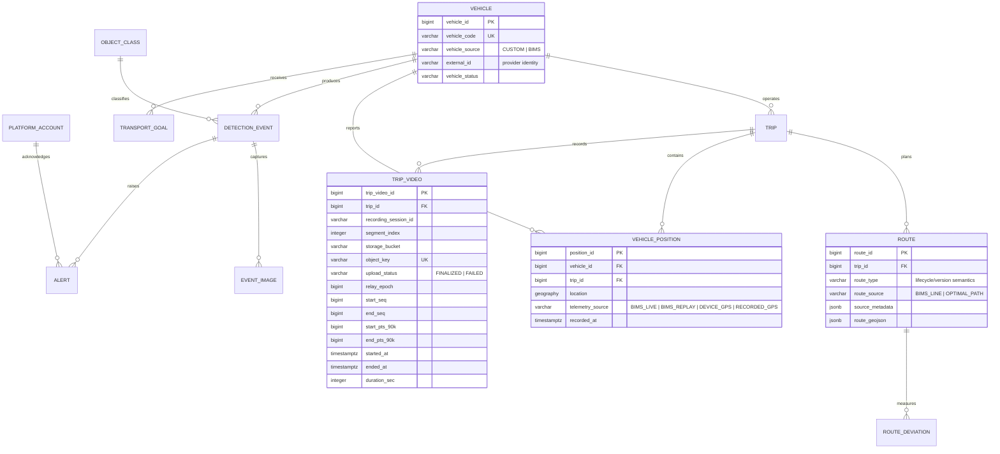

# v17 ITS Integrated ERD

> Historical. Superseded by `v18_its_integrated_erd.md` (Android/device GPS provenance on `vehicle_position`).

Schema at v17: `node/prisma/schema.prisma` (13 tables). This document supersedes earlier ERDs for the integrated product while preserving them as historical records.

`trip_video` stores one independently playable H.264 MP4 segment per row. The durable object identity is `(storage_bucket, object_key)`; `video_url` remains nullable only for legacy compatibility and never stores a presigned URL. Legacy rows without MinIO objects are retained with `upload_status=FAILED` and a `storage_bucket=legacy` marker.

Node owns all persisted entities. The routing/tracking service supplies transient normalized observations; only authoritative source observations are eligible for persistence. Browser interpolation frames are never stored.
