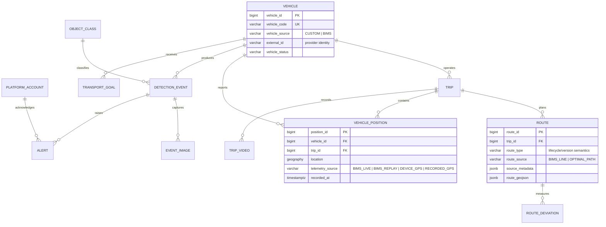

# v17 ITS Integrated ERD

Current schema: `node/prisma/schema.prisma` (13 tables). This document supersedes earlier ERDs for the integrated product while preserving them as historical records.

Node owns all persisted entities. The routing/tracking service supplies transient normalized observations; only authoritative source observations are eligible for persistence. Browser interpolation frames are never stored.
