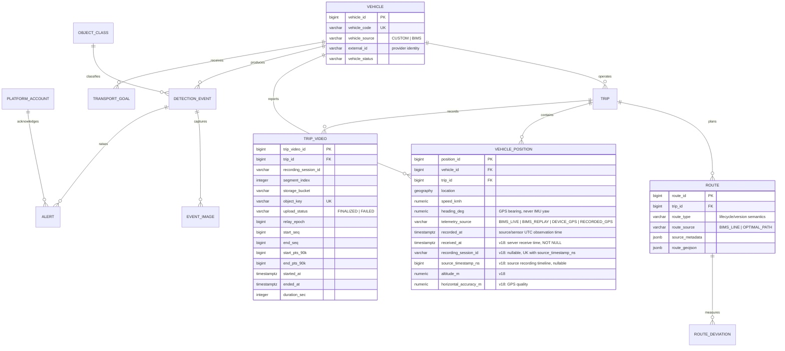

# v18 ITS Integrated ERD

Current schema: `node/prisma/schema.prisma` (13 tables). This document supersedes `v17_its_integrated_erd.md`, which is preserved as a historical record.

v18 adds Android/device GPS provenance to `vehicle_position` (migration `20260918000000_vehicle_position_device_telemetry`). All other tables are unchanged from v17.

## `vehicle_position` (v18)

| Column | Type | Notes |
|---|---|---|
| `recording_session_id` | `VARCHAR(80)` NULL | The validated Android stream session that produced the fix. NULL for BIMS rows. |
| `source_timestamp_ns` | `BIGINT` NULL, `> 0` | Position of the fix on the source recording timeline (the same clock as the video QR `source_timestamp_ns`). |
| `altitude_m` | `DECIMAL(10,3)` NULL | |
| `horizontal_accuracy_m` | `DECIMAL(10,3)` NULL, `>= 0` | Poor accuracy is stored, never used to discard a fix. UI: ≤10 m normal, 10–30 m degraded, >30 m low. |
| `received_at` | `TIMESTAMPTZ(6)` NOT NULL, default now | Server receive time. Existing rows were backfilled from `recorded_at`. |

Indexes: `uq_vehicle_position_session_source_ts (recording_session_id, source_timestamp_ns)` (unique; NULLs are distinct so BIMS rows never conflict) and `idx_vehicle_position_vehicle_received (vehicle_id, received_at)`.

### Two clocks, deliberately separate

- `recorded_at` / `source_timestamp_ns` answer *where was the vehicle at this point in the source recording?* For `RECORDED_GPS` (Android `mode=REPLAY`) `recorded_at` is the original recording's GPS UTC, which can be weeks old.
- `received_at` answers *what did the server most recently receive?* "Current position" queries order by `received_at` (`prisma/sql/getLatestReceivedVehiclePosition.sql`); source-time queries keep `recorded_at` (`getLatestVehiclePosition.sql`, `getTripPositionTrack.sql`).

### Write path and idempotency

Android GPS fixes are persisted by the media relay through `POST /internal/telemetry/gps` as they arrive (`prisma/sql/insertDeviceGpsPosition.sql`, `ON CONFLICT (recording_session_id, source_timestamp_ns) DO NOTHING`), so relay retries and WebRTC reconnects never duplicate rows and history does not depend on anyone polling the tracking API. `mode=REPLAY` is stored as `RECORDED_GPS`, `mode=LIVE` as `DEVICE_GPS`. The trip must belong to the vehicle, a recording session may belong to only one trip/vehicle, and vehicles are never created from device telemetry. Processed IMU (~125 Hz) is transient live-view data and is not stored in this table.

`trip_video` stores one independently playable H.264 MP4 segment per row. The durable object identity is `(storage_bucket, object_key)`; `video_url` remains nullable only for legacy compatibility and never stores a presigned URL. Legacy rows without MinIO objects are retained with `upload_status=FAILED` and a `storage_bucket=legacy` marker.

Node owns all persisted entities. The routing/tracking service supplies transient normalized observations; only authoritative source observations are eligible for persistence. Browser interpolation frames and Vision's interpolated/extrapolated display positions are never stored. BIMS observations are still persisted as a side effect of `GET /api/v1/tracking/vehicles`; moving that to an ingest path is a known follow-up.
