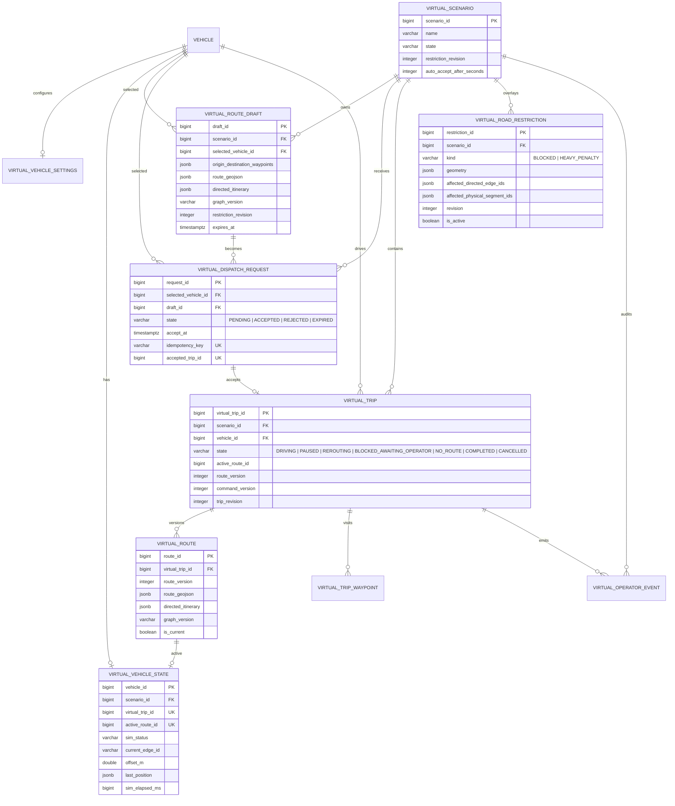

# v19 Virtual Routing and Dispatch ERD

This document supersedes the virtual-domain part of `VIRTUAL_DISPATCH_DETAILED_PLAN.md` with the tables implemented by migration `20260919120000_virtual_dispatch`.

The virtual domain is intentionally separate from real trip telemetry, Android publishing, Go relay state, vision inference, and MinIO recording. A virtual vehicle is a `vehicle` row with `vehicle_source = 'VIRTUAL'`; its authoritative position lives in `virtual_vehicle_state` and is never inserted into `vehicle_position`.

Acceptance is serialized by a serializable Prisma transaction and the partial unique active-trip index. The persistent worker scans due requests and advances `virtual_vehicle_state`; browser polling only renders snapshots and cannot write coordinates.
