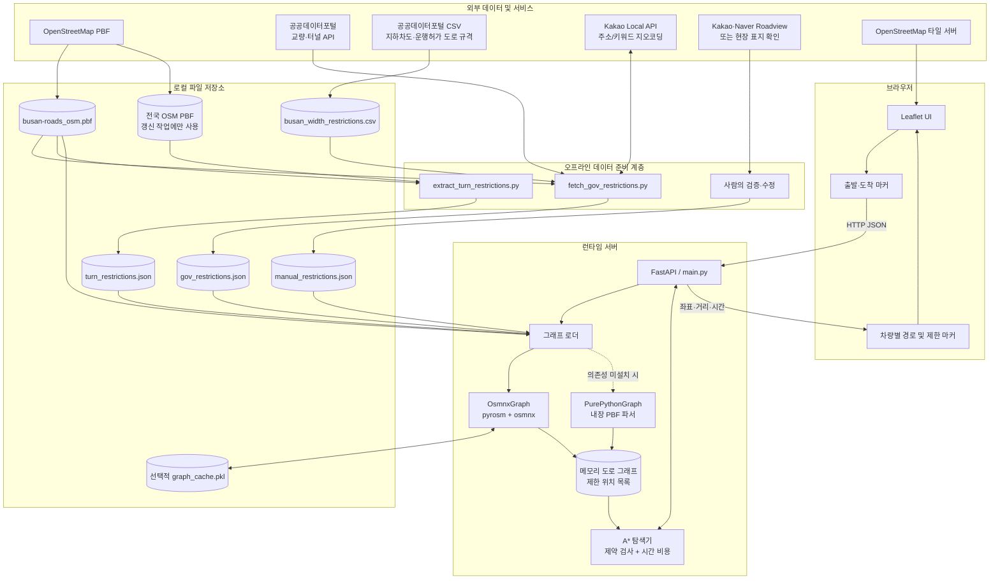
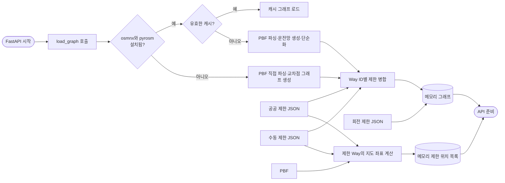
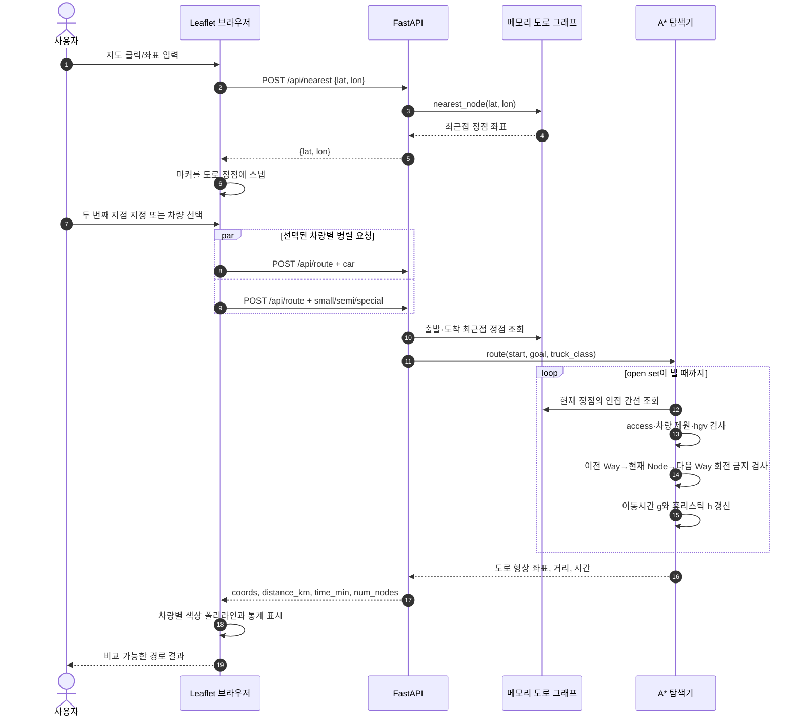
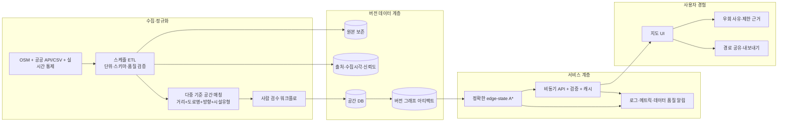

# 부산 차량 제약 기반 A* 경로 탐색 프로젝트 문서

> 문서 기준일: 2026-09-05  
> 분석 범위: 현재 저장소의 실행 코드와 포함 데이터  
> 주의: 이 시스템은 연구·프로토타입 성격이다. 실제 화물 운송, 운행 허가 또는 안전 판단의 단독 근거로 사용해서는 안 된다.

## 1. 문서 개요

이 문서는 부산 지역 도로 지도에서 출발지와 도착지를 지정하고, 차량 종류별 물리·법적 통행 제한을 반영해 A* 알고리즘으로 경로를 계산하는 프로젝트를 설명한다. 다음 질문에 답하는 것이 목적이다.

- **무엇을(What)** 만드는가: OSM 도로망 기반의 차량별 경로 비교 서비스
- **왜(Why)** 만드는가: 최단 경로만으로는 표현하기 어려운 대형 차량의 높이·중량·너비·길이 및 회전 제한을 경로 탐색에 반영하기 위해서
- **어떻게(How)** 동작하는가: PBF 도로 데이터를 그래프로 변환하고 공공·수동 제한정보를 병합한 뒤, 통행할 수 없는 간선을 제외하면서 시간 비용 기반 A*를 수행한다.
- **어디에(Where)** 설계·구현되어 있는가: 브라우저 UI, FastAPI API, 그래프/A* 엔진, 오프라인 데이터 수집 스크립트 및 JSON/CSV/PBF 파일로 나뉘어 현재 저장소에 구현되어 있다.

## 2. 프로젝트 한눈에 보기

### 2.1 핵심 기능

1. Leaflet 지도 클릭 또는 위도·경도 입력으로 출발지와 도착지를 지정한다.
2. 입력 위치를 가장 가까운 도로 그래프 정점으로 스냅한다.
3. 승용차, 소형 트럭, 세미트레일러, 특수화물 차량의 경로를 동시에 요청하고 비교한다.
4. 차량 높이·중량·너비·길이, `hgv`, `access` 제한을 통과 가능 여부에 반영한다.
5. `no_left_turn`, `no_right_turn`, `no_straight_on`, `no_u_turn` 회전 금지를 탐색 중 검사한다.
6. 계산 결과를 실제 도로 형상에 가까운 폴리라인, 거리, 예상 시간으로 표시한다.
7. 현재 지도 화면 안에 있는 공공/수동 제한정보 위치를 선택적으로 표시한다.

### 2.2 현재 포함 데이터 현황

현재 파일을 직접 집계한 결과는 다음과 같다.

| 데이터 | 현재 규모 | 역할 |
|---|---:|---|
| `busan-roads_osm.pbf` | 노드 482,310개, Way 68,473개, Relation 0개 | 부산 도로망의 기본 공간·속성 데이터 |
| `gov_restrictions.json` | OSM Way 제한정보 6,723개 | 공공데이터에서 자동 수집·공간 매칭한 높이·너비·중량 정보 |
| `manual_restrictions.json` | 수동 항목 8개 | 로드뷰·현장 표지 등 사람이 확인한 값을 공공데이터보다 우선 적용 |
| `turn_restrictions.json` | 회전 금지 890개 | 전국 OSM 원본에서 부산 관련 회전 제한만 추출 |
| `busan_width_restrictions.csv` | 약 2.68 MB | 공공 도로 규격 데이터 중 부산 관련 입력 자료 |

현재 `gov_restrictions.json`의 6,723개 항목은 국토교통부 도로 너비/운행허가 데이터에서 매칭된 6,586개와 교량 현황 데이터에서 매칭된 137개로 구성되어 있다. 필드별로는 `maxwidth` 6,714개, `maxweight` 130개, `maxheight` 38개가 들어 있다. 동일 Way에 여러 값이 겹칠 수 있으므로 필드 개수의 합은 항목 수와 일치하지 않는다.

PBF 파일 자체에는 Relation이 없기 때문에 회전 제한은 별도의 전국 단위 PBF에서 추출한 JSON으로 보완한다. 현재 회전 제한은 U턴 금지 539개, 좌회전 금지 193개, 우회전 금지 135개, 직진 금지 23개이다.

## 3. 왜 이 시스템이 필요한가

일반 경로 탐색은 주로 거리나 시간을 최소화한다. 그러나 부산은 항만 물류와 대형 차량 통행 수요가 크고, 지하차도·터널·교량·좁은 도로에서는 차량 제원에 따라 같은 경로를 사용할 수 없다. 따라서 이 프로젝트는 다음 문제를 다룬다.

- 승용차에는 가능한 길이 컨테이너 세미트레일러에는 높이·중량 제한 때문에 불가능할 수 있다.
- 특수화물 차량은 도로 너비나 길이 제한 때문에 우회해야 할 수 있다.
- 물리적으로 통과 가능해도 `hgv=no`, `access=no/private` 또는 금지 회전 때문에 사용할 수 없는 길이 있다.
- OSM 태그만으로는 국내 시설 제한정보가 충분하지 않을 수 있으므로 공공데이터와 사람의 검증 결과를 결합해야 한다.
- 서로 다른 차량 프로필의 경로를 같은 지도 위에 표시하면 제약 조건이 실제 경로에 미치는 영향을 쉽게 비교할 수 있다.

즉, 이 프로젝트의 핵심 개념은 **도로 그래프 + 차량 프로필 + 다중 출처 제한정보를 결합한 제약 기반 최소시간 경로 탐색**이다.

## 4. 설계 및 구현 위치

| 영역 | 파일 | 책임 |
|---|---|---|
| 웹 화면 | `static/index.html` | Leaflet 지도, 출발/도착 마커, 차량 선택, 제한 마커, 경로 폴리라인과 통계 표시 |
| API/애플리케이션 진입점 | `main.py` | 시작 시 그래프 로딩, 요청 검증 모델, 4개 API, 정적 파일 제공 |
| 도메인 및 탐색 엔진 | `graph_backend.py` | 차량 프로필, 제한 판정, 그래프 구축, 최근접 정점 탐색, A* 경로 계산 |
| 경량 PBF 파서 | `pbf_parser.py` | 외부 PBF 라이브러리 없이 Protobuf wire format을 읽어 Node/Way/Relation 추출 |
| 공공데이터 ETL | `fetch_gov_restrictions.py` | 공공 API·CSV 수집, Kakao 지오코딩, OSM Way 공간 매칭, 제한 JSON 생성 |
| 회전 제한 ETL | `extract_turn_restrictions.py` | 전국 PBF의 OSM restriction Relation을 부산 Way 기준으로 필터링 |
| 기본 도로 데이터 | `busan-roads_osm.pbf` | 런타임 그래프의 원천 |
| 자동 제한 오버라이드 | `gov_restrictions.json` | 공공데이터를 OSM Way ID에 연결한 결과 |
| 수동 제한 오버라이드 | `manual_restrictions.json` | 사람이 확인하거나 관리하는 Way별 제한값 |
| 회전 제한 | `turn_restrictions.json` | `(from_way, via_node, to_way)` 금지 전이 목록 |

지리적 적용 범위는 포함된 PBF가 담고 있는 부산 도로망이다. 실행 위치는 단일 FastAPI 프로세스와 사용자의 브라우저이며, 별도 데이터베이스는 없다. 그래프와 제한 위치 목록은 서버 시작 시 메모리에 올라간다.

## 5. 시스템 아키텍처



### 5.1 두 가지 그래프 백엔드

- **권장 백엔드 `OsmnxGraph`**: `pyrosm`으로 PBF를 읽고 `osmnx.simplify_graph`로 그래프를 단순화한다. Shapely geometry를 이용해 도로 곡선을 반환하며, 구축 결과를 `<PBF>.graph_cache.pkl`로 캐시할 수 있다.
- **대체 백엔드 `PurePythonGraph`**: 선택 의존성이 없을 때 내장 PBF 파서가 Node와 Way를 직접 읽는다. 도로의 시작·끝 및 교차 노드를 정점으로 삼고, 구간 거리와 형상을 인접 리스트에 저장한다.

`load_graph()`는 `osmnx`와 `pyrosm`을 import할 수 있으면 권장 백엔드를 선택하고, 그렇지 않으면 순수 Python 구현으로 자동 전환한다. 두 구현 모두 현재는 NetworkX의 `astar_path`가 아니라, 회전 직전의 Way를 확인하기 위해 직접 작성한 A* 루프를 사용한다.

## 6. 데이터는 어떻게 수집되는가

데이터 수집은 요청 때 실시간으로 수행되지 않는다. 별도 스크립트를 사람이 실행하여 정적 파일을 생성하고, 서버는 그 파일을 시작 시 읽는다.

### 6.1 OSM 도로망

`busan-roads_osm.pbf`에서 다음 정보가 사용된다.

- Node ID와 위도·경도
- Way ID와 Node 참조 목록
- `highway`, `oneway`, `maxheight`, `maxweight`, `maxwidth`, `maxlength`, `hgv`, `access` 등의 태그
- 권장 백엔드에서는 단순화된 간선의 `length`, `geometry`, `osmid`

현재 저장소만으로는 부산 PBF를 어디서 어떤 필터와 날짜로 생성했는지 재현할 수 있는 다운로드/추출 스크립트나 메타데이터가 충분하지 않다. 따라서 데이터 계보 개선이 필요하다.

### 6.2 교량·터널 공공 API

`fetch_gov_restrictions.py`는 공공데이터포털의 국토교통부 교량·터널 현황 API를 페이지 단위로 호출한다.

1. `DATA_GO_KR_KEY` 환경변수에서 서비스 키를 읽는다.
2. 기준연도(`--hyear`, 기본 2024) 자료 중 시도명이 부산인 항목만 선택한다.
3. 시설 시작 또는 종료 좌표를 사용한다.
4. `height`, `totWidth`, `alowPass`를 각각 높이, 너비, 중량 제한 후보로 변환한다.
5. 높이 1.5~6.0m, 너비 1.5~30.0m 범위 밖의 값은 이상치로 보고 버린다.

터널 API operation 이름은 코드 주석상 아직 확인이 필요하며, 현재 포함된 `gov_restrictions.json` 집계에는 터널 출처 항목이 없다.

### 6.3 부산 지하차도 CSV

사용자가 공공데이터 CSV를 내려받아 `--underpass-csv`로 전달한다.

- 파일 인코딩은 UTF-8 BOM과 CP949를 순서대로 시도한다.
- 좌표 열이 있으면 그대로 사용한다.
- 좌표가 없으면 `부산광역시 + 시군구 + 시설명`을 Kakao Local API로 지오코딩한다.
- 높이와 너비 열을 찾아 유효 범위 검사 후 제한 후보로 만든다.

현재 포함된 자동 제한 JSON에는 이 출처로 표시된 항목이 없으므로, 스크립트가 지원하는 수집 경로와 현재 산출물의 실제 구성은 구분해야 한다.

### 6.4 운행허가 가능 도로 규격 CSV

`busan_width_restrictions.csv`의 각 행은 출발지 주소와 도착지 주소를 가진 도로 구간이다.

1. 중복 주소를 제거하고 Kakao 주소/키워드 검색으로 좌표를 얻는다.
2. API 호출은 여러 스레드로 처리하되 공통 rate limiter로 약 12요청/초로 제한한다.
3. 출발·도착 좌표의 중점을 구간 대표점으로 사용한다.
4. `제한너비`를 읽고 유효 범위를 검사한다.
5. 대표점을 부산 OSM 도로에 공간 매칭한다.

### 6.5 공공 시설과 OSM Way 매칭

공공데이터의 시설 ID와 OSM Way ID는 직접 연결되어 있지 않다. 따라서 다음 근사 매칭을 한다.

1. PBF에서 `highway` 태그가 있는 Way의 전체 선형을 0.01도 격자에 색인한다.
2. 시설점 주변 3×3 격자의 후보 Way를 찾는다.
3. 시설점과 각 Way 선분 사이의 최소 거리를 지역 등거리 근사로 계산한다.
4. 기본 60m 이내에서 가장 가까운 Way ID에 제한값을 연결한다.
5. 시설명, 출처, 매칭 거리, Roadview 링크와 함께 `gov_restrictions.json`에 저장한다.

이 방식은 **이름이나 도로 방향을 비교하지 않는 최근접 공간 매칭**이다. 평행도로, 상·하부 도로, 교차로, 양방향 분리도로에서 잘못 연결될 수 있다.

### 6.6 수동 검증 정보

`manual_restrictions.json`은 OSM Way ID를 키로 사용한다. 사람이 Roadview 또는 현장 제한 표지를 확인한 뒤 `maxheight`, `maxweight`, `maxwidth`, `maxlength`, `hgv`, `access`를 기록할 수 있다. 값이 `null`이면 경로 계산에는 반영하지 않는다.

병합 시 우선순위는 다음과 같다.

```text
OSM 원본 태그 < gov_restrictions.json < manual_restrictions.json
```

즉, 같은 Way와 같은 제한 필드가 충돌하면 수동 값이 최종값이 된다.

현재 수동 파일의 설명에는 일부 값이 미검증 placeholder라고 되어 있는데 실제 8개 항목에는 모두 숫자가 들어 있다. 이 불일치는 실제 운행에 사용하기 전에 반드시 정리해야 한다.

### 6.7 회전 제한

부산 PBF에는 Relation이 없으므로 `extract_turn_restrictions.py`가 별도의 전국 OSM PBF를 읽는다.

1. 전국 파일의 `type=restriction` Relation을 찾는다.
2. `from` Way, `via` Node, `to` Way가 모두 존재하는 항목을 선택한다.
3. 부산 PBF의 Way와 관련된 항목만 남긴다.
4. 지원되는 `no_*` 제한을 `(from_way, via_node, to_way)` 구조로 JSON에 저장한다.

`only_left_turn` 같은 `only_*` 제한과 via-Way 형태의 복합 제한은 현재 지원하지 않는다.

## 7. 수집된 데이터는 어떻게 사용되는가

### 7.1 서버 시작 시 처리



권장 백엔드의 그래프 캐시는 PBF, 공공 제한 JSON 또는 수동 제한 JSON보다 오래되면 무효화하고 다시 만든다. 회전 제한은 캐시에 포함하지 않고 시작할 때 별도로 읽으므로 해당 JSON만 갱신해도 그래프 재구축은 필요 없다.

### 7.2 차량 프로필과 간선 통행 판정

| 프로필 | 높이 | 총중량 | 너비 | 길이 | 최고속도 |
|---|---:|---:|---:|---:|---:|
| `car` | 제한 비교 안 함 | 제한 비교 안 함 | 제한 비교 안 함 | 제한 비교 안 함 | 100 km/h |
| `small` | 2.5 m | 3.5 t | 1.9 m | 5.0 m | 100 km/h |
| `semi` | 4.0 m | 40.0 t | 2.5 m | 18.0 m | 80 km/h |
| `special` | 4.5 m | 40.0 t | 3.0 m | 20.0 m | 70 km/h |

간선은 다음 순서로 판정된다.

1. `access=no/private`이면 모든 차량에 대해 차단한다.
2. 승용차 모드이면 그 밖의 화물차 제원 제한은 검사하지 않는다.
3. 차량 높이·중량·너비·길이가 제한값 이상이면 차단한다.
4. `hgv=no`이면 화물차를 차단한다.
5. 통과한 간선만 A*의 이웃 후보가 된다.

현재 비교식은 `차량 제원 >= 제한값`일 때 차단한다. 이는 표지와 데이터의 법적 의미가 “이상 금지”라는 프로젝트 가정에 따른 것이다.

### 7.3 A* 비용과 휴리스틱

탐색 목적은 최소 거리가 아니라 **예상 이동시간 최소화**이다.

```text
간선 비용 g 증가량 = 간선 길이 / min(도로 등급 기본속도, 차량 최고속도)
휴리스틱 h(n) = 현재 정점과 목적지의 대권거리 / 차량 최고속도
우선순위 f(n) = g(n) + h(n)
```

도로에 실제 `maxspeed`가 있더라도 현재 비용 계산에는 사용하지 않고 `highway` 등급별 고정 속도표를 사용한다. 휴리스틱은 실제로 가능한 최고속도를 이용한 시간 하한이므로 이 가정 안에서는 과대평가하지 않도록 설계되어 있다.

### 7.4 사용자 경로 요청의 상세 데이터 흐름



### 7.5 제한 마커 조회 흐름

제한 마커는 6천 개 이상이므로 초기 화면에서는 불러오지 않는다. 사용자가 표시 옵션을 켜면 브라우저가 현재 지도 경계상자(bbox)를 `/api/override-locations`에 전달한다. 서버는 시작 시 준비한 목록을 bbox로 필터링하고 최대 500개를 반환한다. 지도 이동/확대 종료 후 250ms debounce하여 다시 조회하며, 오래된 비동기 응답은 sequence 번호로 무시한다.

주의할 점은 현재 `verified`가 “사람이 검증함”을 뜻하지 않는다는 것이다. 코드상 제한 필드 중 하나라도 값이 있으면 `true`이므로 자동 매칭된 공공데이터도 대부분 verified로 표시된다. 출처(`government`/`manual`)와 인간 검증 상태를 별도 필드로 나누는 것이 필요하다.

## 8. API 명세 요약

### `GET /api/truck-classes`

백엔드의 차량 프로필 이름을 UI에 제공한다. 차량 제원 전체는 노출하지 않고 표시 이름만 반환한다.

### `POST /api/nearest`

요청:

```json
{"lat": 35.18, "lon": 129.08}
```

응답은 가장 가까운 그래프 정점의 `lat`, `lon`이다.

### `POST /api/route`

요청:

```json
{
  "start_lat": 35.18,
  "start_lon": 129.08,
  "end_lat": 35.16,
  "end_lon": 129.12,
  "truck_class": "semi"
}
```

성공 응답:

```json
{
  "coords": [[35.18, 129.08], [35.179, 129.082]],
  "distance_km": 8.421,
  "time_min": 13.25,
  "num_nodes": 142,
  "truck_class": "semi"
}
```

경로가 없으면 HTTP 404를 반환한다.

### `GET /api/override-locations`

`min_lat`, `max_lat`, `min_lon`, `max_lon`, `limit`을 받아 지도 범위 내 제한 위치를 반환한다. 기본 `limit`은 500이다.

## 9. 실행 방법

Python 3.10 이상이 필요하다.

```bash
uv sync --extra osmnx
uv run uvicorn main:app --reload
```

그 후 브라우저에서 `http://127.0.0.1:8000`을 연다. 선택 의존성 없이 실행하려면 `uv sync`만 사용하며 순수 Python 백엔드로 전환된다.

공공 제한정보를 다시 만들 때의 예시는 다음과 같다.

```bash
python fetch_gov_restrictions.py \
  --width-csv busan_width_restrictions.csv \
  --underpass-csv busan_underpass.csv
```

이 작업에는 입력 종류에 따라 `DATA_GO_KR_KEY`와 `KAKAO_REST_API_KEY`가 필요하다. 회전 제한은 별도의 전국 OSM PBF를 준비한 뒤 다음과 같이 갱신한다.

```bash
python extract_turn_restrictions.py --source south-korea-latest.osm.pbf
```

Windows PowerShell에서는 위 여러 줄 예시의 `\` 대신 backtick을 사용하거나 한 줄로 실행해야 한다.

## 10. 현재 설계의 한계

1. **정적 데이터**: 폴더명에 `dynamic`이 있지만 실시간 교통, 사고, 공사, 기상, 통제정보는 수집하지 않는다. 경로는 정적 그래프와 파일에 의해 결정된다.
2. **공간 매칭 오차**: 공공 시설을 이름·방향·도로 레벨 없이 최근접 Way 하나에 연결한다. 입체교차와 평행도로에서 오매칭 가능성이 크다.
3. **도로 구간 축약**: 출발/도착 주소가 있는 너비 데이터는 중점 하나를 Way 하나에 연결하므로 원래 구간 전체를 표현하지 못한다.
4. **데이터 의미 검증 필요**: “운행허가가 가능한 도로의 규격” 값을 곧바로 `maxwidth` 차단 기준으로 사용하는 것이 원자료의 법적 의미와 일치하는지 확인해야 한다.
5. **회전 상태 모델 단순화**: A*의 상태가 `(정점, 진입 Way)`가 아니라 정점 중심이고, 정점마다 최선의 진입 하나만 보존한다. 진입 Way에 따라 다음 회전 가능성이 달라지는 경우 유효 경로를 놓치거나 제한을 정확히 처리하지 못할 수 있다.
6. **일부 OSM 제한 미지원**: `only_*`, via-Way 회전 제한, 조건부 제한(`*:conditional`), 차로별 제한을 처리하지 않는다.
7. **속도 모델 단순화**: OSM `maxspeed`, 신호, 교차로 지연, 경사, 교통량을 사용하지 않는다. 반환 시간은 실제 도착예정시간이 아니라 등급별 속도 가정에 따른 비용이다.
8. **최근접 도로 거리 제한 없음**: 클릭점에서 매우 먼 정점도 주변 격자에 존재하면 스냅될 수 있다. 바다나 서비스 범위 밖 입력을 명확히 거절하는 최대 반경이 없다.
9. **서버 확장성**: 그래프가 프로세스 메모리에 있고 API가 동기 함수로 CPU 집약 A*를 수행한다. 다중 worker는 메모리를 중복 사용하고, 단일 worker는 동시 요청에 취약하다.
10. **전체 제한 위치 사전 계산**: 시작할 때 PBF를 다시 파싱해 제한 위치를 만든다. 그래프 로딩과 중복 작업이 발생해 시작 시간이 늘어난다.
11. **검증 상태 혼동**: 제한값의 존재와 인간 검증 완료를 같은 `verified` 값으로 표현한다.
12. **입력 및 프로필 검증 부족**: API 모델에 위·경도 범위 제한과 `truck_class` enum이 없다. 알 수 없는 프로필이 제한 없는 차량처럼 처리될 수 있다.
13. **데이터 충돌 처리 부족**: 자동 생성 코드에는 “더 가까운 매칭을 유지”한다는 주석이 있지만 실제로 같은 Way ID가 다시 나오면 후행 항목이 덮어쓴다. 출처별 여러 제한을 보존하지도 않는다.
14. **테스트와 관측성 부족**: 단위/통합/회귀 테스트, 구조화 로그, 검색 노드 수와 지연시간 메트릭이 없다.
15. **외부 프런트엔드 의존성**: Leaflet 코드와 OSM 지도 타일을 CDN/외부 서버에서 받아오므로 완전한 오프라인 UI는 아니다.
16. **HTML 안전성**: 제한정보의 이름·메모·링크를 `innerHTML`에 직접 넣으므로 신뢰하지 않는 데이터가 들어올 경우 XSS 방어가 필요하다.

## 11. 개선 방향과 우선순위

### 우선순위 1 — 데이터 신뢰성과 안전성

- 공공데이터 원본의 필드 정의와 법적 경계조건을 확인하고 단위·비교 연산을 데이터 사전에 명시한다.
- `source`, `collected_at`, `source_record_id`, `source_url`, `matched_distance_m`, `match_method`, `human_verified_at`, `verified_by`, `confidence`를 구조화한다.
- 최근접 거리뿐 아니라 도로명 유사도, 방향, 시설 유형, 교량/터널 OSM 태그를 함께 점수화한다.
- 한 시설을 한 점으로 축약하지 말고 시작·종료 좌표 사이의 실제 OSM 경로 구간에 제한을 적용한다.
- 자동 매칭 결과를 검수 대기 상태로 저장하고 승인 후 운영 그래프에 반영하는 staging 절차를 둔다.
- 수동 placeholder를 운영 제한값과 분리하고 근거 이미지 또는 원문 레코드에 연결한다.

### 우선순위 2 — 경로 정확성

- A* 상태를 `node`에서 `(node, incoming_way 또는 incoming_edge)`로 확장해 회전 제한을 정확히 처리한다.
- `only_*`, via-Way, 조건부·시간대별·차종별 OSM 제한을 지원한다.
- `maxspeed`와 차량별 법정속도, 회전 비용, 신호 지연을 간선 비용에 반영한다.
- 차량이 제한값과 같은 경우의 허용 여부를 제한 종류와 법령별 정책으로 분리한다.
- 정점 스냅 최대 거리와 서비스 영역 polygon 검사를 추가한다.
- 도로 중간점으로 스냅할 수 있도록 가장 가까운 간선 위 좌표를 찾고 가상 시작/종료 정점을 만든다.

### 우선순위 3 — 소프트웨어 구조와 성능

- ETL 산출물을 SQLite/GeoPackage/PostGIS처럼 공간 질의 가능한 저장소로 이전하고, bbox 조회에 공간 인덱스를 사용한다.
- 그래프 빌드 단계와 API 실행 단계를 분리해 버전이 붙은 그래프 아티팩트를 배포한다.
- PBF 중복 파싱을 제거하고 제한 위치 좌표를 ETL 결과에 미리 저장한다.
- 프로필과 속도표를 검증 가능한 설정 파일 또는 관리 API로 분리한다.
- 잘못된 `truck_class`는 HTTP 422로 거절하고 위·경도 및 `limit` 범위를 검증한다.
- 대규모 요청에는 경로 캐시, 작업 큐 또는 전용 라우팅 worker를 검토한다.

### 우선순위 4 — 제품 기능

- 실시간/예정 도로 통제, 공사, 교통속도, 침수 위험을 시간 유효성이 있는 오버레이로 추가한다.
- “왜 이 경로를 우회했는가”를 제한 시설과 함께 설명하는 경로 근거 UI를 제공한다.
- 차량의 실제 제원을 직접 입력하고 여러 대안 경로를 비교하게 한다.
- 데이터 최신일, 출처, 신뢰도, 미검증 경고를 지도와 결과 화면에 표시한다.
- 경로 공유, GeoJSON/GPX 내보내기, 실패 구간 진단 기능을 추가한다.
- OSM/공공데이터 라이선스, attribution, 개인정보·API 키 운영 정책을 배포 문서에 포함한다.

## 12. 권장 목표 아키텍처



이 목표 구조에서 가장 중요한 변화는 “제한값이 있는가”가 아니라 **그 값이 언제, 어디서, 어떤 방법으로 수집·매칭·검증되었는가**를 경로 결과까지 추적할 수 있게 만드는 것이다.

## 13. 검증 전략 제안

- **단위 테스트**: 단위 문자열 파싱, 경계값 통행 판정, 일방통행, 속도 비용, 휴리스틱 admissibility를 검증한다.
- **작은 합성 그래프 테스트**: 차량 제한 때문에 우회하는 경우, 진입 Way에 따라 회전 가능성이 달라지는 경우, 경로가 없는 경우를 고정한다.
- **ETL 품질 테스트**: 좌표 범위, 단위, 중복 Way 충돌, 매칭 거리 분포, 출처별 건수 변화를 검사한다.
- **골든 경로 회귀 테스트**: 부산의 대표 출발/도착 쌍과 차량별 예상 통과/우회 결과를 버전 관리한다.
- **현장/지도 교차검증**: 제한 표지와 실제 시설 위치를 표본 조사하고 오매칭률을 기록한다.
- **성능 테스트**: 그래프 시작 시간, 메모리 사용량, 최근접 탐색과 A*의 p50/p95 지연시간, 방문 정점 수를 측정한다.

## 14. 요약

이 프로젝트는 부산 OSM 도로망을 그래프로 만들고, 공공데이터와 수동 확인 제한정보를 Way ID 기준으로 병합해 차량별 통행 가능성을 반영하는 A* 경로 탐색기다. 프런트엔드는 Leaflet, API는 FastAPI, 핵심 탐색은 `graph_backend.py`, 데이터 수집과 가공은 두 오프라인 스크립트가 담당한다.

현재 구현은 차량 제약이 경로에 미치는 영향을 시각적으로 실험하기에 유용하지만, 공공데이터의 의미와 자동 공간 매칭 정확도, 인간 검증 상태, 회전 제한 상태 모델을 개선해야 실제 운송 의사결정에 가까워질 수 있다. 다음 단계는 **데이터 계보와 검수 체계 확립 → edge-state A* 정확화 → 테스트와 관측성 추가 → 실시간 데이터 확장** 순서가 적절하다.
